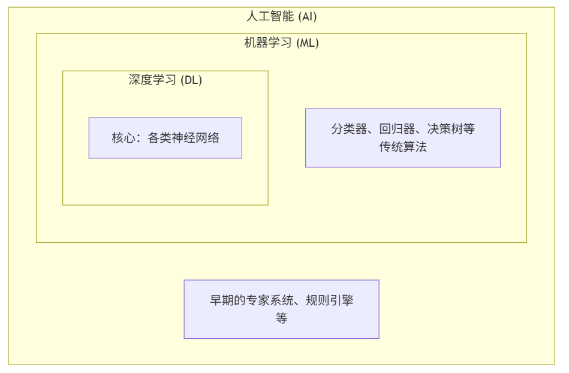
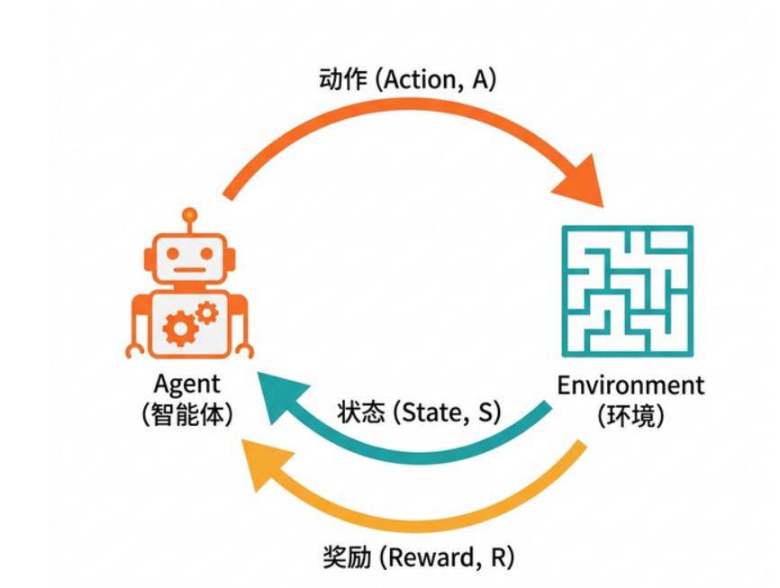
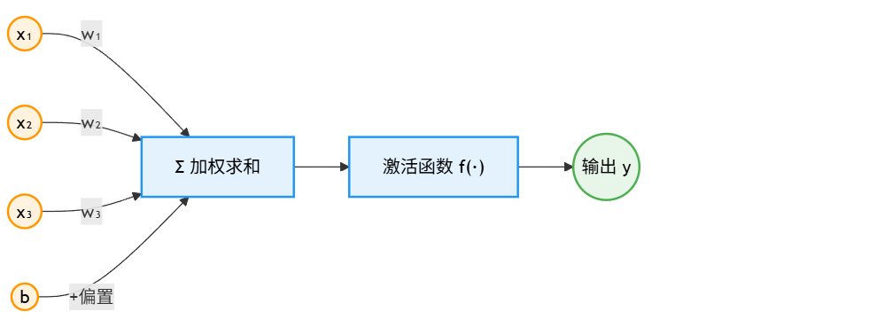
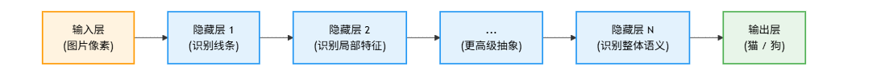
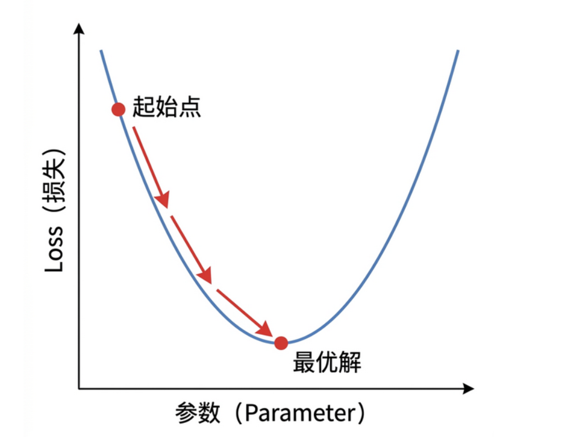
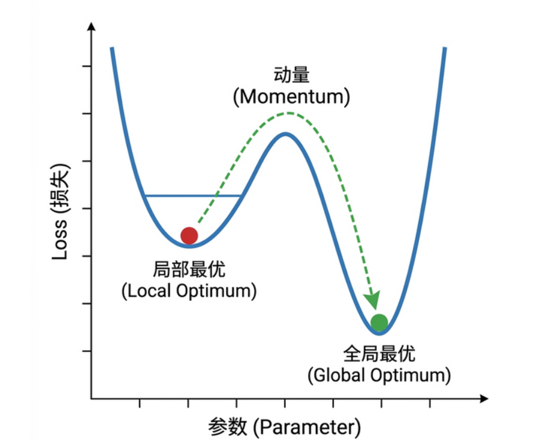
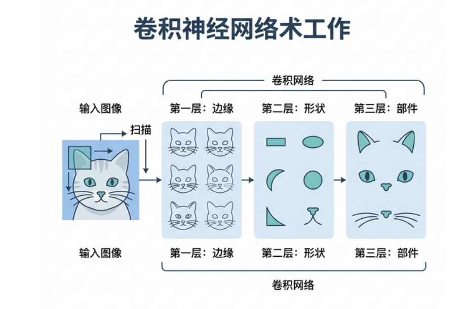

# 走进人工智能世界
## 算得快不代表聪明
几十年前计算机就能在几毫米内算出炮弹的飞行轨迹，以往这需要几十个科学家算几天，基于计算机算的快的特点，科学家认为让计算机识别物体也很简单，但是确遇到了困难。
传统计算机程序严重依赖于**清晰的规则**，但是现实世界的复杂性导致很难制定准确的规则，而事实上，人类识别什么是猫从来不是依靠什么清晰的规则，而是靠**直觉**或者说**默认规则**
于是科学家转变了思路，由制定规则到传授**经验**：直接告诉程序这个是猫，这个不是，通过海量的数据和奖惩机制，让程序逐渐具备了识别物体的能力。
**这就是人工智能（AI）的本质转变：**
- **过去（Coding）**：我们需要把 **人类的智慧** 翻译成 **代码规则**。
- **现在（Training）**：我们把 **人类的经验**（即使是不可言传的）打包成 **数据** 喂给它。
### 价值互换：算力换认知
AI出现以前，**计算力**很便宜，但**认知力**很贵。
现在AI做的事就是**燃烧大量的计算力，通过海量数据的训练，提炼出认知力**，让认知的成本下降时，世界的逻辑就变了，以前需要多年经验的医生才能看懂的片子，现在只需要花费一点电力AI就能看懂。
所以，不仅仅是程序员，各行各业的人都得重新思考：你的工作里，有哪些是“死板的计算”（将被淘汰），有哪些是“模糊的认知”（将被 AI 廉价化），又有哪些是 AI 依然无法替代的呢？
## 寒冬与里程碑
**AI=(算力，算法，数据)**
### 两次寒冬
当人们对一项技术的 **期望值**（Expectation），远远超过了它的 **实际能力**（Capability）时，灾难就不可避免。
- **第一次寒冬（70年代）**：人们发现，那个年代的电脑连几句简单的俄语都翻译不通。
- **第二次寒冬（90年代）**：昂贵的“专家系统”维护成本极高，却解决不了稍微变通一点的问题。
### 三座里程碑
**AI 战胜人类的三座里程碑**
回顾历史，AI 在特定领域超越人类的标志性事件同样让人印象深刻：
- **1997 年**：“深蓝”（Deep Blue）战胜国际象棋世界冠军卡斯帕罗夫，主要依赖于**强大的算力和穷举搜索**。
- **2016 年**：“AlphaGo”战胜围棋世界冠军李世石，让大众首次见识到了**深度学习与强化学习**的巨大威力。
- **2022 年至今**：以 ChatGPT 为代表的大语言模型，则在**自然语言理解和生成**上达到了甚至超越了人类平均水平。
### IPhone时刻
2022 年 ChatGPT 的发布，常被媒体称为 AI 的 **“iPhone 时刻”**。
**与前两次相比，这一轮的基础条件更扎实，但仍可能出现周期波动。**
回顾历史，我们可以看到，这一次的爆发，是因为三个关键要素终于齐备了：
1. **算力（Chips）**：GPU/专用加速器持续迭代，训练与推理成本快速下降。
2. **数据（Data）**：互联网数据用完后，高质量的 **合成数据**（Synthetic Data，即 AI 为了训练自己而自动生成的“练习题”）接过了接力棒。
3. **算法（Algorithm）**：Transformer 架构依然稳健（其原理详见[第 5 章](https://yeasy.gitbook.io/ai_beginner_guide/di-er-bu-fen-he-xin-ji-shu-jie-xi/05_deep_learning/5.3_architectures)），而“更擅长推理/规划”的新一代模型与方法，让机器学会了某种意义上的“慢思考”。
ChatGPT 最大的贡献，是把复杂的 AI，变成了连老奶奶都会用的工具（自然语言交互）。
当一项技术，**使用门槛被大幅降低** 时，它就不再是少数人的技术，而更接近像水和电一样的基础设施。这才是“春天”真正到来的标志。
## 强AI(AGI)与弱AI(Narrow AI)
### 弱AI
弱AI是指领域特定的AI。
- **AlphaGo**：下围棋，全世界没人下得过它。
- **人脸识别 AI**：哪怕你化了妆，它也能不到 0.1 秒把你认出来。
但它们的致命弱点是 **“不可迁移”**。
目前，**我们生活中用到的绝大多数 AI，本质上仍是弱 AI**。它们是极致的工具（Tools），而不是通用的智能（Intelligence）。
### 强AI
科学家梦寐以求的，是像人类一样“一通百通”的智能，这也就是人们常说的**通用人工智能（AGI，Artificial General Intelligence）**，甚至未来可能演化出超越人类的**超级人工智能（ASI）**。
理想中，人类不需要为每个任务单独写程序。我们学会了骑自行车，很快就能学会骑摩托车，这就是 **“迁移学习”** 的能力。
现在的AI还不能完全称之为强AI，但已经见到一点曙光。
### 生成式AI
在强弱之分以外，我们还可以再加一条理解坐标：**判别式 vs 生成式**。
- **以前的 AI（判别式）**：像是 **“质检员”**。给它东西，它只负责打标签（是猫/不是猫，是垃圾邮件/不是）。
- **现在的 AI（生成式）**：像是 **“设计师”**。你给它要求，它给你“造”出东西来。
这个转变是革命性的。因为“创造”（Creation）一直被认为是人类独有的神性。现在，机器也能画出从未见过的画，写出从未有过的诗。
这意味着，AI 从“做判断”（决策辅助）转变成了“做生产”（生产力工具）。
## 总结
**什么是人工智能**
- AI 是使机器能够模拟人类认知功能的技术，包括学习、推理、问题解决、感知等能力
- 与传统软件不同，AI 从数据中学习规则，而非由程序员预先定义
- 当前的 AI 系统具备感知、学习、推理、决策和生成等核心能力
**AI 的发展历程**
- 1956 年达特茅斯会议标志着 AI 作为独立学科的诞生
- AI 发展经历了多次繁荣与寒冬的交替循环
- 2012 年深度学习革命开启了 AI 发展的新纪元
- 2022 年起，生成式 AI 进入公众视野，标志着新时代的到来
**AI 的分类体系**
- 按能力水平：弱人工智能（当前所有 AI）→ 强人工智能（未实现）→ 超级人工智能（假设）
- 按学习方式：基于规则、机器学习、深度学习
- 按功能领域：计算机视觉、自然语言处理、语音技术、推荐系统、决策智能
- 按任务类型：判别式 AI（分类和预测）vs 生成式 AI（创造内容）
**AI 的应用领域**
- 日常生活：智能手机、语音助手、智能家居、个性化推荐
- 专业领域：医疗诊断、金融风控、自动驾驶、智能制造
- 创意产业：文本生成、图像创作、音乐制作、视频生成
# 核心概念

## AI、ML、DL
1. 最外层的大娃娃叫 **AI（人工智能）** —— 这是一个 **愿景**（让机器像人）。
2. 中间层的娃娃叫 **ML（机器学习）** —— 这是一个 **手段**（不用规则，用数据）。
3. 最里层的娃娃叫 **DL（深度学习）** —— 这是一个 **具体的工具**（用神经网络）。

### AL到ML
从 1980 年代开始，人们发现规则写不完，于是发明了 **“机器学习”（Machine Learning）**。
这相当于不再写手册了，而是给机器人看 10 万小时的开车视频，让它自己悟出红绿灯的规律。
**这一次进化，是从“授人以鱼”（给规则）变成了“授人以渔”（给数据）。**
### ML到DL
机器学习里有很多方法，比如“决策树”、“贝叶斯”等等。它们都很优秀，但有一个共同的瓶颈：**虽然不用写规则了，但还得告诉机器关注哪里。**

比如认猫，你得告诉算法：关注“耳朵”是不是尖的，关注“胡须”长不长。这些“耳朵”、“胡须”叫 **特征**。发现和选择合适特征的过程叫 **“特征工程”**。长期以来，特征工程是机器学习领域最核心的技术。

人们曾试图用人工神经网络来自动解决特征工程的问题，但是受限于计算能力，一直只能用浅层网络来处理一些简单的任务。

直到 2012 年，**“深度学习”（Deep Learning）** 横空出世，多层人工神经网络取得了突破。

人工神经网络的灵感来自人脑的神经元。它最大的本事是：**我什么都不需要你告诉我，我自己找特征**。它会自动发现，原来“瞳孔的形状”比“耳朵的形状”更能区分猫。

**这一次进化，是从“半自动”（人找特征）变成了“全自动”（端到端学习）。**
### 深度学习的优点
**第一，“胃口大，没有天花板”**
没有数据上限，喂的数据越多越优秀。
**第二，擅长破解“非结构化数据”**
## 数据
**高质量数据和算法同等关键，但数据质量往往决定上限**。
以前，我们认为软件公司的核心资产是 **可口可乐配方（源代码）**。
### 数据就是石油
现在，AI 公司的核心资产是 **地下的油田（用户数据）**。
### 数据的诅咒：垃圾进，垃圾出
在数据这个领域，有一个著名的诅咒叫 **GIGO (Garbage In, Garbage Out)**。

如果你用网上带有偏见的帖子去训练 AI，AI 很可能会学到并放大这些偏见。

如果你用错误的医疗记录去训练 AI，AI 的医疗建议就会显著增大出错风险。

所以，AI 工程师 80% 的时间，其实不是在高大上的写代码，而是在当 **“数据清洁工”**。

清洗、去重、标注、对齐……这像极了在炼油厂里过滤杂质。只要杂质没去干净，炼出来的油（模型）就会损坏发动机。
### 比黄金还贵的“标注”与合成数据
## 算法
### 算法与模型
- **  
    算法（Algorithm）**：是那张 **“菜谱”**。比如“深度神经网络”、“决策树”，它们是一套通用的逻辑方法。你没做菜之前，它就在那儿了。
    
- **模型（Model）**：是你照着菜谱，用具体的食材（数据），炒出来的 **“那盘菜”**。
### 黑盒：当我们不知道菜谱时
**深度学习算法**，是一个 **“黑盒”**。
现在的 AI 就是这样。我们知道输入（照片），知道输出（猫），但中间那几百层神经网络到底是怎么判断的？就像那个黑盒一样，连制造它的科学家都很难解释清楚。

这就是为什么 AI 有时候会犯一些莫名其妙的错误（幻觉），因为它本身就是一种 **“概率的黑魔法”**。
## 训练
我们经常说“训练”（Training）这个词。
很多人脑补的画面是：机器人哪怕坐在图书馆里，如饥似渴地阅读人类的经典名著，然后突然顿悟了。
完全错了。
真实的训练过程，更像是一个 **只做练习题、靠反馈改错** 的学生。
### 损失函数
在 AI 领域，偏差有多大，有一个专门的数学名字，叫 **“损失函数”（Loss Function）**。

你也可以把它叫作 **“误差指数”**。

- 猜对了：损失接近 0。
    
- 猜得离谱：损失很高。
    
- 猜得沾边：损失中等。
    

模型训练的核心优化目标之一，就是 **“让损失降到最低”**（Minimize Loss）。

它没有“理解世界”的主观意图，只是在参数空间里不断优化。

这听起来很冷酷，但也是最符合经济学原理的：**任何智能系统，本质上都是在追求成本最小化（Cost Minimization）。**
### 训练与推理
- **  
    训练（Training）**：是 **“造核弹”**。需要成千上万张显卡，耗电量相当于一个小城市，花好几个月，烧掉几亿美金。这是只有巨头才玩得起的游戏。
    
- **推理（Inference）**：是 **“放鞭炮”**。训练好的模型，甚至能在你的手机上运行。每次问它一个问题，只消耗一点电。
## 总结
**AI、机器学习与深度学习的关系**

- 三者是包含关系：AI ⊃ 机器学习 ⊃ 深度学习
    
- AI 是追求让机器表现智能的广泛愿景
    
- 机器学习是实现 AI 的主要手段，通过数据学习规律
    
- 深度学习使用多层神经网络，能自动提取特征，在超大规模数据下持续获益
    

**数据：AI 的燃料**

- 高质量数据和合适算法同等关键，但数据质量往往决定上限
    
- 数据是 AI 时代的核心资产，堪比“石油”
    
- GIGO（垃圾进，垃圾出）：劣质数据会导致模型输出错误
    
- 数据标注成本高昂，合成数据成为新趋势
    

**算法与模型**

- 算法是“菜谱”（通用方法），模型是“炒好的菜”（具体成果）
    
- Transformer 是算法，GPT 系列是模型
    
- 深度学习模型是“黑盒”，连科学家也难以解释内部逻辑
    

**训练与推理**

- 训练就是反复做题并订正，通过损失函数衡量偏差
    
- 训练的核心优化目标是让损失降到最低
    
- 推理是使用训练好的模型进行预测，成本远低于训练
# AI技术生态与工具
## 硬件到应用
### 倒金字塔
如果我们把 AI 行业画成一张图，它是一个巨大的倒金字塔：
- 最底层最窄，也是最硬的，是 **芯片（Hardware）**，比如 NVIDIA GPU、TPU 等。
- 往上一层是 **基础设施（Infrastructure）**，比如云平台、智算中心等。
- 再往上是 **框架（Frameworks）**，比如 PyTorch、TensorFlow、JAX 等。
- 最上面最宽的，是 **应用（Applications）**，比如 ChatGPT、Sora、Midjourney、Copilot 等。
### 芯片
**GPU（显卡）**
### 框架
**PyTorch** 或 **TensorFlow** 这样的 **深度学习框架**。
### 模型
## 云厂商
### Iaas or Maas
以前的云计算（IaaS），就像是 **“租厨房”**。

AWS 给你提供锅碗瓢盆（服务器、算力），你自己买菜（数据），自己雇厨子（开发人员），自己做饭（训练模型）。

这很灵活，但太累了。

现在的 AI 云（MaaS - Model as a Service），就像是 **“点外卖”**。

你不必自己训练大模型，而是直接调用云上的托管模型、向量数据库、内容审核、监控等服务。

这种模式把 AI 的门槛从“自己造引擎”降到了“按需组合能力”。
### 三大平台
1. **微软 (Microsoft Azure)**：**企业集成与治理导向**。
    
    - 强项在企业身份体系（Microsoft 365、Entra、Defender）与 AI 服务整合，适合“要治理、要审计、要统一采购”的大组织。
2. **谷歌 (Google Cloud)**：**模型与数据产品一体化**。
    
    - 自研芯片（TPU）+ Gemini + 数据分析产品协同较强，适合与 Google 生态深度结合的团队。
3. **亚马逊 (AWS)**：**多模型与基础设施深耕**。
    - Bedrock 支持多家模型，配合 AWS 原有基础设施和 DevOps 体系，适合“多云/多模型并行评测”的工程团队。
## 开源框架
### PyTorch、TensorFlow 与 JAX
在深度学习框架里，**PyTorch** 和 **TensorFlow** 仍是最常见的两大阵营，另外 **JAX** 在研究和高性能训练场景也越来越活跃。
这有点像手机系统里既有主流双寡头，也有细分强者。
- **TensorFlow**（由 Google 创造并主要支持）：生态成熟，部署工具链完整，在部分传统企业场景仍很常见。
- **PyTorch**（由 Meta 创造并主要支持）：在研究和开源社区占比更高，教程和示例丰富，上手门槛相对低。
- **JAX**（由 Google 创造并主要支持）：函数式和并行化能力强，常见于前沿研究和高性能训练实验。
现在的趋势是：**PyTorch 在研究和开源社区的使用占比很高**。大量最新论文和开源项目会优先给出 PyTorch 版本。
对初学者来说，先学 PyTorch 往往更顺手；但落地到生产时，仍要尊重团队技术现状和部署要求。

### Hugging Face：AI 界的 GitHub
在这里，你可以：

1. **下载模型**：全世界的开发者把训练好的模型（LLaMA, BERT, Stable Diffusion）上传上来，你一键就能下载用。
2. **体验 Demo**：不用写代码，直接在网页上点一点，就能体验最新的 AI 功能。
3. **下载数据**：海量的公开数据集供你训练。
可以说，Hugging Face 显著降低了开源 AI 的试错成本。
## 云端AI与端侧AI
### 云端
### 侧端
### 混合
## 总结
**AI 技术栈的层次**

- 芯片层（GPU）：门槛最高，NVIDIA 一家独大
    
- 基础设施层（云平台）：提供算力和服务
    
- 框架层（PyTorch 等）：开发者用来“画图纸”的工具
    
- 模型层（预训练模型）：相当于“预制板”，拿来即用
    
- 应用层：面向用户的产品和服务
    

**主流 AI 平台与服务**

- 微软 Azure：企业集成与治理导向
    
- Google Cloud：模型与数据产品一体化
    
- AWS：多模型与基础设施深耕
    
- 选择平台应按约束条件（合规、技术、组织）而非单纯“谁最强”
    

**开源框架与工具**

- PyTorch 在研究和开源社区占比最高
    
- TensorFlow 生态成熟，部署工具链完整
    
- JAX 在前沿研究和高性能训练场景活跃
    
- Hugging Face 是 AI 界的“GitHub”，大幅降低试错成本
    
- AI 编程助手（Copilot、Cursor 等）正推动 Agentic Coding
    

**云端 AI 与边缘 AI**

- 云端：算力强、模型大，但依赖网络、有隐私顾虑
    
- 边缘：低延迟、保护隐私，但受设备限制
    
- 未来趋势是混合架构，日常简单任务在端侧，复杂任务上云
    
# 机器学习原理
## 归纳法与机器学习
> 机器学习本质上是一种“归纳法”。历史会重复，但不会完全重复。

机器学习是基于 **“归纳法”**（Induction）的。它所有的智慧都来自 **“过去”**（历史数据）。

它假设未来会重复过去。但一旦出现从未见过的 “黑天鹅”（比如感恩节），再强大的 AI 也会瞬间变成傻瓜。

### 演绎法 vs 归纳法
人类的推理方法有两种，对应了机器学习的两种实现方式：

1. **演绎法（Deduction）**：从公理推导出结果。
    
    - _例子_：所有人都会死（公理） -> 苏格拉底是人 -> 苏格拉底会死。
        
    - _特点_：基于规则，绝对正确，但很难发现新知识。传统的计算机程序（If/Else）就是演绎法。
        
    
2. **归纳法（Induction）**：从现象总结出规律。
    
    - _例子_：看到 1000 只天鹅是白的 -> 推测所有天鹅都是白的。
        
    - _特点_：基于统计数据，**可能出错**，但能处理复杂世界。**机器学习就是归纳法。**
        
    

**所以，千万不要迷信 AI 的预测。** AI 预测股市上涨，只是因为它在历史数据中找到了跟当前类似的模式，不代表明天真的会涨。
### 四大门派

在归纳法的世界里，根据“有没有老师教”，分成了四个门派：

| 门派                                  | 类比         | 关键点                       | 典型例子             |
| ----------------------------------- | ---------- | ------------------------- | ---------------- |
| **监督学习（Supervised Learning）**       | 有老师批改作业    | 有数据 + 标签（答案），照着学（最成熟、最常用） | 分类、回归（如房价预测）     |
| **无监督学习（Unsupervised Learning）**    | 自己看书做归纳    | 只有数据、没有标签，自己找结构           | 聚类、降维（以及部分推荐）    |
| **强化学习（Reinforcement Learning）**    | 在环境里试错     | 用奖励/惩罚信号学策略               | AlphaGo、机器人控制、游戏 |
| **自监督学习（Self-Supervised Learning）** | 做完形填空/文字接龙 | 用数据“自己生成标签”再学习            | GPT 等大模型的预训练     |

## 监督学习
> 监督学习就是“刷题”。有标签，叫监督；没标签，叫无监督。

**监督学习（Supervised Learning）** 是目前 AI 领域最成熟、应用最广的技术。

它的本质，就是一场 **填鸭式教育**。

想象一个 **“虎妈”**（算法）教育孩子（模型）：

1. **刷题**：虎妈拿出一张照片（输入 X），问：“这是什么？”
    
2. **回答**：孩子瞎猜：“是猫。”
    
3. **打分**：虎妈看了一眼背面写着的标准答案（标签 Y），说：“错！这是狗。”
    
4. **修正**：孩子挨了一手板，记住了这次教训。
    

在数据质量和训练流程都可靠的前提下，这种流程反复足够多次，模型识别能力通常会显著提升。

很多成熟 AI 应用（人脸识别、语音识别、垃圾邮件拦截）都建立在监督学习或其变体之上。
### 分类问题与回归问题
在监督学习的试卷上，主要有两种题型：

1. **分类问题（Classification）** —— **做选择题**。
    
    - 答案是 **离散** 的，有限个选项。
        
    - _例子_：这封邮件是垃圾邮件吗？（A. 是 / B. 否）
        
    - _例子_：这个图是数字几？（A. 0 / B. 1 ... / J. 9）
        
    
2. **回归问题（Regression）** —— **做填空题**。
    
    - 答案是 **连续** 的数字，可能性无限。
        
    - _例子_：明天的房价是多少？（填：500万，501万...）
        
    - _例子_：这孩子能长多高？（填：170cm，170.1cm...）
        
    

所以，区分它们的秘诀很简单：**看输出结果是不是“连贯”的数值。**

### 监督学习的代价：昂贵的“答案”
既然监督学习这么好用，为什么我们不把所有 AI 都做成监督学习？

因为 **“标准答案”（标签）** 太贵了。

这哪里是训练数据，简直是用黄金铺出来的。 **数据标注成本**，是阻碍监督学习发展最大的拦路虎。

> [!NOTE] 在工程实践中，监督学习决不止步于“模型预测-纠正”，它必须通过严密的数学与指标评估来防止模型“死记硬背”（即过拟合），确保其具备举一反三的能力（泛化能力）。一个标准的监督学习工程闭环包含：
> 
> 1. **数据划分**：将数据集严格分为 **训练集**（Training Set，通常占80%）和 **测试集**（Test Set，通常占20%）。训练集用于学习规律，测试集用于考试验证。
>     
> 2. **目标函数（Loss Function）**：衡量模型预测值与真实标签之间差距的公式（如回归问题的均方误差 MSE，分类问题的交叉熵）。
>     
> 3. **优化算法**：通过特定的算法（最典型的如梯度下降法）不断微调千千万万个内部参数（权重与偏差），使得目标函数（误差）尽可能地缩小。
>     
> 4. **可观测评估指标**：在测试集上计算成绩。分类问题看准确率（Accuracy）、精确率（Precision）和召回率（Recall）；回归问题看均方根误差（RMSE）等。
>
## 无监督学习
> 不用老师也能学，一个人也能在超市里分辨薯片和饼干。物以类聚，把书读薄。
### 聚类、降维和异常检测
无监督学习有三大法宝：
1. **聚类（Clustering）**：把相似的东西归到一起。
    - _例子_：电商平台把你和跟你消费习惯类似的人归为一组，然后把那组人买的你没买的东西推荐给你。这就是“猜你喜欢”背后的逻辑。
2. **降维（Dimensionality Reduction）**：把复杂的东西简化。
    - _例子_：一张照片有 100 万个像素（维度太高）。AI 发现，其实只要记住“两条眉毛一张嘴”这几个关键特征（维度降低），就能认出这个人。
3. **异常检测（Anomaly Detection）**：从寻常中发现不寻常。    
    - _例子_：银行系统如何发现你的信用卡可能被盗刷了？AI 不需要提前知道所有骗局的模样，它只要知道你平时的消费习惯，一旦发现一笔凌晨 3 点在境外的巨额消费（偏离常态），就会立刻报警。
## 强化学习
> 生命是在“奖励”和“惩罚”中进化的。AI 也是。胡萝卜加大棒。
### 从条件反射到 AlphaGo
**强化学习（Reinforcement Learning）** 是最接近生物本能的一种学习方式。
它的直观类比之一，是生理学家 **巴甫洛夫** 的“条件反射”（注意：条件反射并不等同于现代强化学习算法，但它能帮你快速抓住“奖励驱动行为改变”的直觉）。
- 摇铃铛 -> 给肉吃 -> 狗流口水。
- 重复多次后 -> 摇铃铛 -> 狗流口水。
在这个过程中，狗并不懂铃铛原本的含义，它只学到了一件事：**听到这个声音，会有“奖励”（Reward）。** 为了得到这个奖励，它调整了自己的行为（流口水）。
这就是 AlphaGo 打败柯洁的秘密：
- **动作**：落下一颗棋子。
- **环境**：棋盘发生了变化。
- **反馈**：赢了（+1分），输了（-1分）。
- **目标**：为了拿到那个“+1分”，它疯狂地自我对弈了几亿盘，最终学会了神之一手。

### 延迟满足：强化学习的难点
普通的“条件反射”很简单。但强化学习最难的地方在于 **“延迟满足”（Delayed Reward）**。
下围棋时，你第一步下在天元，可能要到第 200 步才知道这一步是好棋还是臭棋。
这就好比你现在努力读书（动作），是为了 20 年后能过上好日子（奖励）。
中间这 20 年，你没有直接的奖励，甚至还有痛苦（考试不及格）。
AI 是如何坚持下来的？
这就涉及到 **“价值函数”（Value Function）**：AI 能够预估当下的这一步，在遥远的未来有多少价值。**看得越远，智商越高。**
### RLHF：怎么教 AI 说人话？
强化学习虽然厉害（能打游戏、能控制机器人），但以前一直被认为“不太实用”。
直到 **ChatGPT** 的出现，它完成了一次华丽的转身。
ChatGPT 本来是个“话痨”，什么话都敢接。
为了让它懂礼貌、不乱说脏话，OpenAI 引入了 **人类反馈强化学习（RLHF）**。这一对齐技术此前在 OpenAI 的经典论文 **InstructGPT** (2022) 中得到了里程碑式的工程化验证。
更准确地说，RLHF 常见流程是：先让人类标注员对多条候选回答做“偏好排序/对比”，形成偏好数据；再用强化学习（如 PPO 算法）或类似的对齐优化方法，让模型更倾向于人类更喜欢的回答风格与边界。
在一些产品里也可能会利用 **汇总后的** 用户反馈来改进，但它通常不会“你点一下赞，模型立刻变聪明一分”——你的单次交互更像是进入了改进流程的素材库，是否使用、何时使用，取决于产品政策与训练节奏。
这就是为什么现在的 AI 越来越像人：它不断被人类偏好数据与安全边界“对齐”，输出风格也更贴近人类的沟通习惯。
## 强化学习的场景与挑战
## 自监督学习
想象一下，你正在做英语考试中的“完形填空”题：

> The weather is very hot today, I want to eat an ice ____.

即使我不给你看答案，你也能凭借几十年来积累的常识，猜出这里填 **“cream” (冰淇淋)** 的概率最大，而不是 “hockey” (冰球) 或 “car” (汽车)。

**你是怎么做到的？** 并没有老师在旁边告诉你“这里必须填 cream”，而是你阅读了无数句子后，掌握了单词之间的搭配规律。**这种利用上下文（Context）来预测缺失部分的能力，就是自监督学习的核心。**

监督学习需要人工标注标签，无监督学习纯粹自己找规律，自监督学习介于二者之间，自监督学习的价值就是数据本身就是标签。
他的工作流程：
1. 把数据设置掩码
2. 大模型猜测
3. 计算损失
**哪怕没有任何人工标注的数据，只要有海量的互联网文本，模型就可以通过这种“日夜不停地做完形填空”，学到语言的语法、语义和世界知识。**

- **BERT 模型**：利用“完形填空”（Masked Language Modeling），学会了双向理解语言。
- **GPT 模型**：利用“文字接龙”（Next Token Prediction），即根据上文预测下一个字，学会了生成流畅的文本。
**小知识**：GPT 的全称是 **G**enerative **P**re-trained **T**ransformer。其中的 **Pre-trained (预训练)** 指的就是在一个超大规模数据集上进行 **自监督学习** 的过程。
## 总结

**机器学习的核心思想**

- 机器学习本质上是一种“归纳法”，从历史数据中总结规律
    
- 归纳法很强大，但永远无法获得绝对真理（“罗素的火鸡”）
    
- 四大门派：监督学习、无监督学习、强化学习、自监督学习
    

**监督学习**

- 使用带标签的数据进行训练，本质是“填鸭式教育”
    
- 分类问题（做选择题）vs 回归问题（做填空题）
    
- 最大瓶颈：高质量标签数据的获取成本极高
    

**无监督学习**

- 处理无标签数据，在没有“标准答案”的情况下发现规律
    
- 三大法宝：聚类（“物以类聚”）、降维（“把书读薄”）和异常检测（“从寻常中发现不寻常”）
    

**强化学习**

- 智能体通过与环境交互，靠“奖励”和“惩罚”来学习
    
- 延迟满足（Delayed Reward）是最大难点
    
- RLHF 让大模型学会了“说人话”，是 ChatGPT 成功的关键
    

**自监督学习**

- 介于监督与无监督之间，数据本身即标签
    
- 核心机制：掩码（挖空）与预测（填空），类似“完形填空”
    
- 把海量无标注的互联网文本变成了训练“金矿”
    
- 是 GPT（文字接龙）和 BERT（完形填空）预训练的基础
# 深度学习

## 神经网络
### 仿生学的起点
- **生物神经元**：接收电信号 -> 达到阈值 -> 啪！发电给下一个神经元。
- **人工神经元**：接收数字 -> 加权求和 -> 激活函数 -> 把结果传给下一层。

### 为什么是深度
因为神经网络是分层的。
- 输入层：接收图片像素。
- 隐藏层：负责处理。
- 输出层：告诉你是猫是狗。
如果中间的隐藏层只有几层，叫“浅层网络”（它很笨，只能解决简单问题）。
如果中间有几百层，就叫 **“深度网络”（Deep Neural Network）**。
**深度**，就是网络的 **层数很多**。

### 激活函数
如果只有加减乘除，神经网络其实就是一堆线性方程，永远无法解决复杂问题。
必须给它加一点 **非线性** 的“佐料”，这就叫 **激活函数**。
在很长一段时间里，科学家们爱用一种叫 **Sigmoid** 的函数，但它在网络很深时容易“失灵”。现在，最著名的激活函数变成了 **ReLU**。别看名字高大上，它的逻辑简单得令人发指：
- 如果输入 < 0，输出 0（不激活，装死）。    
- 如果输入 > 0，输出原值（激活，传递信号）。
就是这么个简单的开关，让神经网络有了模拟世间万物的能力。
## 深度学习训练
### 梯度下降
梯度下降就是不断更新参数，以找到最低的损失也就是最优解

### 学习率
更新参数的过程中，涉及到下降幅度的问题，也就是学习率，学习率过小或过大都不好，过小训练过程太慢，过大可能跳过最优解，比较好的方式是先快后慢（学习率衰减）。

### 局部最优
梯度下降有一个问题，就是当前找到的最优解可能只是局部最优解。
为了解决这个问题，科学家发明了各种“魔改版”下山法，比如 **SGD（随机梯度下降）** 和 **Adam**。

它们就像给你的下山过程加了一点 **“惯性”（动量）**。
**可观测的过拟合与早停策略**
从工程角度看，只讲“梯度下降”是不够的。模型训练最大的敌人是 **过拟合（Overfitting）**——模型在训练题上拿了满分，遇到没见过的新题却一塌糊涂。

1. **可观测证据**：我们需要同时绘制两条跟踪曲线：**训练集 Loss 曲线**（通常持续下降）和 **验证集（Validation Set）Loss 曲线**。一旦发现验证集 Loss 降到某一点后开始停滞甚至 **反弹上升**，这就是模型“死记硬背”导致泛化能力崩溃的铁证。
    
2. **早停与回调（Early Stopping）**：在监控到上述的“剪刀差”现象，即验证集 Loss 连续 N 轮没有改善时，框架（如 PyTorch Lightning / Keras）通过代码强制触发拦截停止训练，并回滚恢复到保存的最佳权重状态（Checkpoint）。

## 深度学习架构
### CNN：眼睛
**卷积神经网络（CNN）** 是专门为 **图像** 而生的。
通过它，计算机终于“看”懂了世界。
它的核心法宝叫 **“卷积核”（Filter）**。

CNN 的哲学是：**局部这一小块像素，比整张图更重要。** 正是因为 CNN，我们才有了人脸识别、自动驾驶、医学影像 AI。
### RNN：耳朵
如果说图像是 **空间** 的（上下左右），那么语言就是 **时间** 的（先后顺序）。

“我爱你”和“你爱我”，字完全一样，但顺序变了，意思就反了。

处理这种序列数据，就要靠 **RNN（循环神经网络）**。
### Transformer：大脑

## 深度学习的局限性