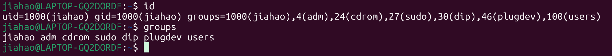

# Shell
Shell 是操作系统内核和用户之间的 “翻译官”—— 你在终端输入的命令（比如 `ls`、`cd`），需要 Shell 解析后交给内核执行，再把结果返回给你。

`sh` 和 `bash` 都是具体的 Shell 程序，只是诞生背景和功能不同。
## sh
sh是最初标准的shell。
- **全称**：Bourne Shell（以开发者 Stephen Bourne 命名），诞生于 1979 年的 Unix 系统。
- **定位**：Unix 系统的**默认标准 Shell**，语法简单、功能基础，是所有 Shell 的 “鼻祖” 之一。
- **特点**：仅支持最核心的 Shell 语法（比如条件判断 `if`、循环 `for`），没有扩展功能，兼容性极强（所有类 Unix 系统都支持）。
- **存在形式**：在现代系统中，`/bin/sh` 通常不是独立程序，而是**指向其他 Shell 的软链接**（比如指向 `bash`、`dash` 等）。
## bash
bash是sh的增强版（最主流）。
- **全称**：Bourne-Again Shell（“Bourne 重生版”），由 GNU 项目开发，1989 年发布。
- **定位**：`sh` 的**超集**—— 完全兼容 `sh` 的所有语法，同时新增了大量实用功能。
- **核心增强功能**（对比 `sh`）：
    
    - 命令历史记录（按 `↑` 回看之前输入的命令）；
    - 命令补全（按 `Tab` 自动补全命令 / 文件名）；
    - 通配符增强（比如 `{1..5}` 生成 1-5 序列）；
    - 数组、函数、正则表达式支持；
    - 更灵活的变量扩展（比如 `${var:-默认值}`）。
    
- **现状**：Linux 系统（如 Ubuntu、CentOS）的**默认 Shell** 就是 `bash`，macOS 早期也默认用 `bash`（后期切换为 `zsh`，但仍兼容）。
## 系统级目录
这类目录下的配置文件会影响所有登录系统的用户，通常需要 `root` 权限修改。

| 目录          | 作用（与 sh / 环境变量的关联）                                                                                                                                                                                                                                                                                                                                                                    |
| ----------- | ------------------------------------------------------------------------------------------------------------------------------------------------------------------------------------------------------------------------------------------------------------------------------------------------------------------------------------------------------------------------------------- |
| `/etc`      | 存放系统核心的 Shell 配置文件，是环境变量全局配置的核心目录：<br><br>- `/etc/profile`：全局登录 Shell 配置（所有用户登录时执行，设置全局环境变量如 `PATH`、`USER`）；<br><br>- `/etc/profile.d/`：拆分的配置文件目录（如 `java.sh`、`python.sh`，会被 `/etc/profile` 自动加载，用于给不同软件设置环境变量）；<br><br>- `/etc/bashrc`/`/etc/bash.bashrc`：全局非登录 Shell 配置（如终端交互时的别名、函数，部分系统的 `sh` 也会读取）；<br><br>- `/etc/environment`：纯环境变量配置文件（仅存 `KEY=VALUE` 格式，无 Shell 语法，系统启动时加载）。 |
| `/bin`      | 系统基础命令目录，`PATH` 环境变量默认包含（`sh` 执行的 `ls`、`cd`、`echo` 等核心命令都在这里）。                                                                                                                                                                                                                                                                                                                        |
| `/usr/bin`  | 用户常用命令目录，`PATH` 默认包含（如 `python`、`git` 等非系统核心命令）。                                                                                                                                                                                                                                                                                                                                      |
| `/usr/sbin` | 系统管理命令目录（`root` 用），`PATH` 中 `root` 用户会包含，普通用户可能无权限执行。                                                                                                                                                                                                                                                                                                                                 |
## 用户级目录
这类目录在用户主目录（`~`，等价于 `/home/用户名`）下，配置仅对当前用户生效：

| 目录              | 作用（与 sh / 环境变量的关联）                                                                                                                                                                                                                                                           |
| --------------- | ---------------------------------------------------------------------------------------------------------------------------------------------------------------------------------------------------------------------------------------------------------------------------- |
| `~`（/home/ 用户名） | 用户主目录，核心配置文件存放地：<br><br>- `~/.profile`：用户登录 Shell 配置（`sh`/`bash` 登录时执行，设置用户专属环境变量）；<br><br>- `~/.bash_profile`：`bash` 专属登录配置（优先级高于 `~/.profile`，若存在则优先执行）；<br><br>- `~/.bashrc`：`bash` 非登录交互配置（如终端别名、自定义函数，`sh` 模式下不读取）；<br><br>- `~/.bash_logout`：用户退出登录时执行的配置（可清理临时环境变量等）。 |
| `~/.local/bin`  | 用户自定义命令目录（新版系统推荐），可将自己的脚本 / 程序放在这里，添加到 `PATH` 后即可全局执行。                                                                                                                                                                                                                       |
## 环境变量加载顺序

1. 系统启动：先加载 `/etc/environment`（纯环境变量）；
2. 用户登录：执行 `/etc/profile` → 加载 `/etc/profile.d/*` → 执行 `~/.bash_profile`（若不存在则执行 `~/.profile`）；
3. 打开终端（非登录）：执行 `/etc/bashrc` → 执行 `~/.bashrc`；
4. `sh` 模式：仅加载 `/etc/profile`、`~/.profile`（禁用 `bash` 扩展，不读 `.bashrc`）。

---

# Linux 防火墙体系

## 整体架构

```
用户态工具（配置层）
  ┌─────────────┐  ┌──────────┐  ┌───────────┐
  │    ufw       │  │ firewalld │  │ iptables   │
  │  (Ubuntu)    │  │ (RHEL系)  │  │  (通用)     │
  └──────┬───────┘  └─────┬─────┘  └─────┬─────┘
         │                │              │
         └────────────────┼──────────────┘
                          ▼
内核态框架（执行层）
  ┌─────────────────────────────────────────┐
  │              Netfilter（内核模块）         │
  │   实际拦截和处理网络数据包的内核基础设施     │
  └─────────────────────────────────────────┘
```

> **核心关系**：Netfilter 是内核里真正干活的，iptables/ufw/firewalld 都是给用户操作 Netfilter 的前端工具。

## 一、Netfilter（内核层）

Linux 内核自带的网络包过滤框架，工作在内核空间。

**5 个钩子点（Hook Point）**，数据包经过网络协议栈时会被拦截：

```
PREROUTING → INPUT → [本机进程] → OUTPUT → POSTROUTING
                  ↘ FORWARD ↗
```

| 钩子点 | 作用 |
|---|---|
| **PREROUTING** | 数据包刚进入网卡，路由判断之前（DNAT 在这里） |
| **INPUT** | 数据包 destined 到本机进程 |
| **FORWARD** | 数据包经过本机转发到其他机器 |
| **OUTPUT** | 本机进程发出的数据包 |
| **POSTROUTING** | 数据包即将离开网卡（SNAT 在这里） |

## 二、iptables（经典工具）

直接操作 Netfilter 的用户态工具，按**表 → 链 → 规则**三级结构组织。

### 四张表（按优先级排列）

| 表 | 用途 | 常用链 |
|---|---|---|
| **raw** | 关闭连接追踪（NOTRACK） | PREROUTING, OUTPUT |
| **mangle** | 修改数据包头部（TTL、TOS 等） | 全部五链 |
| **nat** | 地址转换（DNAT/SNAT） | PREROUTING, OUTPUT, POSTROUTING |
| **filter** | 过滤放行/拒绝（最常用） | INPUT, FORWARD, OUTPUT |

### 五条链

对应 Netfilter 的 5 个钩子点：PREROUTING、INPUT、FORWARD、OUTPUT、POSTROUTING。

### 数据包匹配流程

```
数据包进入
  → raw.PREROUTING
  → mangle.PREROUTING
  → nat.PREROUTING（DNAT）
  → 路由判断：发往本机 or 转发？
      ├→ 本机：mangle.INPUT → filter.INPUT → 本机进程
      └→ 转发：mangle.FORWARD → filter.FORWARD → mangle.POSTROUTING → nat.POSTROUTING（SNAT）

本机进程发包
  → raw.OUTPUT → mangle.OUTPUT → nat.OUTPUT → filter.OUTPUT
  → mangle.POSTROUTING → nat.POSTROUTING（SNAT）
  → 数据包发出
```

### 常用命令

```bash
# 查看规则
iptables -L -n -v
iptables -t nat -L -n

# 放行 SSH（22 端口）
iptables -A INPUT -p tcp --dport 22 -j ACCEPT

# 放行 HTTP/HTTPS
iptables -A INPUT -p tcp --dport 80 -j ACCEPT
iptables -A INPUT -p tcp --dport 443 -j ACCEPT

# 默认拒绝所有入站
iptables -P INPUT DROP
iptables -P FORWARD DROP

# 允许已建立的连接
iptables -A INPUT -m state --state ESTABLISHED,RELATED -j ACCEPT

# DNAT（端口转发）：外部访问 8080 转到内网 192.168.1.100:80
iptables -t nat -A PREROUTING -p tcp --dport 8080 -j DNAT --to-destination 192.168.1.100:80

# SNAT（源地址转换）：内网通过本机上网
iptables -t nat -A POSTROUTING -s 192.168.1.0/24 -j MASQUERADE
```

## 三、nftables（iptables 的继任者）

内核 3.13+ 引入，设计目标就是取代 iptables。

**解决了 iptables 的痛点：**

| 问题 | iptables | nftables |
|---|---|---|
| 规则更新 | 逐条替换，每条都是一个单独命令 | 原子更新，批量操作 |
| 性能 | 线性匹配规则 | 支持集合、字典，O(1) 查找 |
| 语法 | 分散在多张表多条链 | 统一语法，更简洁 |
| 代码重复 | IPv4/IPv6 各一套规则 | 一套规则同时处理 v4/v6 |

```bash
# 查看规则
nft list ruleset

# 示例：放行 SSH
nft add rule ip filter input tcp dport 22 accept
```

> 主流发行版（CentOS 8+、Debian 11+、Ubuntu 22.04+）已默认使用 nftables，但保留了 iptables 兼容层（iptables 命令实际翻译成 nftables 规则）。

## 四、firewalld（RHEL/CentOS 系默认）

RHEL 系发行版的上层管理工具，核心概念是 **zone（区域）**。

```bash
# 查看当前区域
firewall-cmd --get-default-zone

# 查看当前区域的放行规则
firewall-cmd --list-all

# 放行端口
firewall-cmd --add-port=8080/tcp --permanent
firewall-cmd --reload

# 放行服务
firewall-cmd --add-service=http --permanent

# 端口转发
firewall-cmd --add-forward-port=port=8080:proto=tcp:toport=80:toaddr=192.168.1.100 --permanent
```

**Zone（区域）概念**：不同网络环境用不同规则集

| Zone    | 含义                  |
| ------- | ------------------- |
| trusted | 完全信任，放行所有           |
| home    | 家庭网络，信任度高           |
| public  | 公共网络，默认只放行 SSH/DHCP |
| drop    | 拒绝所有入站              |

底层实际调用的也是 nftables（CentOS 8+）或 iptables（CentOS 7）。

## 五、ufw（Ubuntu 默认）

Ubuntu 的简化防火墙工具，全称 "Uncomplicated Firewall"。

```bash
# 启用/禁用
ufw enable
ufw disable

# 放行/拒绝端口
ufw allow 22/tcp
ufw allow 80/tcp
ufw deny 3306/tcp

# 放行服务
ufw allow ssh
ufw allow http

# 查看状态
ufw status verbose

# 删除规则
ufw delete allow 80/tcp

# 限定来源 IP
ufw allow from 192.168.1.0/24 to any port 22
```

底层也是操作 iptables/nftables，只是把复杂语法简化了。

## 六、工具选择建议

| 场景 | 推荐 |
|---|---|
| Ubuntu 个人服务器 | **ufw**（最简单） |
| RHEL/CentOS 生产服务器 | **firewalld**（Zone 管理方便） |
| 需要精细控制（NAT、mangle） | **iptables** 或 **nftables** |
| 新项目，长期维护 | **nftables**（未来方向） |
| 容器/云环境 | 用云平台安全组 + 轻量主机防火墙 |

> **Netfilter** 是内核引擎，**iptables/nftables** 是底层配置工具，**ufw/firewalld** 是上层简化封装。选哪个取决于你的发行版和需求复杂度。

---

# Linux 包管理体系

## 整体架构

```
用户态
  ┌──────────┐ ┌──────────┐ ┌──────────┐ ┌───────────┐
  │   dpkg    │ │   rpm    │ │ snap/    │ │  flatpak  │
  │ (Debian系)│ │ (RedHat系)│ │ flatpak  │ │           │
  └────┬─────┘ └────┬─────┘ └────┬─────┘ └─────┬─────┘
       │             │            │              │
  ┌────┴─────┐ ┌────┴─────┐      │              │
  │   apt    │ │  dnf/    │      │              │
  │          │ │  yum     │      │              │
  └────┬─────┘ └────┬─────┘      │              │
       │             │            │              │
       ▼             ▼            ▼              ▼
  ┌──────────────────────────────────────────────────┐
  │                  包格式（底层）                     │
  │     .deb                    .rpm          .snap/.flatpak
  └──────────────────────────────────────────────────┘
```

> 核心分三层：**底层包格式**（.deb / .rpm）→ **高层包管理器**（apt / dnf）→ **通用包格式**（snap / flatpak / AppImage）

## 一、两大阵营

### 1. Debian 系（.deb 格式）

适用发行版：Ubuntu、Debian、Linux Mint、Deepin

**dpkg** — 底层工具，直接操作 .deb 文件

```bash
dpkg -i package.deb      # 安装
dpkg -r package          # 卸载
dpkg -l                  # 列出所有已安装包
dpkg -L package          # 查看包安装了哪些文件
dpkg -s package          # 查看包详细信息
```

局限：不会自动解决依赖关系，装包时提示缺依赖就卡住了。

**apt** — 高层工具，自动处理依赖 + 从仓库下载

```bash
apt update               # 更新软件源索引
apt upgrade              # 升级所有可升级的包
apt install package      # 安装（自动解决依赖）
apt remove package       # 卸载（保留配置）
apt purge package        # 卸载（删除配置）
apt autoremove           # 清理不再需要的依赖
apt search keyword       # 搜索包
apt show package         # 查看包详情
apt list --installed     # 列出已安装的包
```

软件源配置文件：`/etc/apt/sources.list` 和 `/etc/apt/sources.list.d/*.list`

### 2. Red Hat 系（.rpm 格式）

适用发行版：RHEL、CentOS、Fedora、Rocky、AlmaLinux

**rpm** — 底层工具，直接操作 .rpm 文件

```bash
rpm -ivh package.rpm     # 安装
rpm -e package           # 卸载
rpm -qa                  # 列出所有已安装包
rpm -ql package          # 查看包安装了哪些文件
rpm -qi package          # 查看包详细信息
```

同样不会自动解决依赖。

**yum** — RHEL/CentOS 7 及以前的高层工具（已逐步淘汰）

**dnf** — yum 的继任者，Fedora 18+ / RHEL 8+ 默认

```bash
dnf check-update         # 检查更新
dnf update               # 升级所有包
dnf install package      # 安装
dnf remove package       # 卸载
dnf search keyword       # 搜索
dnf info package         # 查看包详情
dnf list installed       # 列出已安装
dnf autoremove           # 清理无用依赖
dnf repolist             # 查看启用的仓库
```

软件源配置：`/etc/yum.repos.d/*.repo`

### 两大阵营对比

| 对比项 | Debian 系 | Red Hat 系 |
|---|---|---|
| 包格式 | `.deb` | `.rpm` |
| 底层工具 | `dpkg` | `rpm` |
| 高层工具 | `apt` | `dnf`（新版）/ `yum`（旧版） |
| 仓库格式 | `sources.list` | `.repo` 文件 |
| 配置文件目录 | `/etc/apt/` | `/etc/yum.repos.d/` |
| 本地包数据库 | `/var/lib/dpkg/` | `/var/lib/rpm/` |
| 缓存目录 | `/var/cache/apt/` | `/var/cache/dnf/` |
| 代表发行版 | Ubuntu、Debian | RHEL、CentOS、Fedora |

## 二、apt 与 apt-get 的关系

`apt-get` 和 `apt` 底层完全一样，区别只在用户体验上。

```
apt = apt-get + apt-cache 的精简整合版，加了颜色、进度条、更友好的输出
```

### 命令对应关系

| apt（推荐） | apt-get / apt-cache（传统） | 说明 |
|---|---|---|
| `apt install` | `apt-get install` | 安装包 |
| `apt remove` | `apt-get remove` | 卸载包 |
| `apt purge` | `apt-get purge` | 卸载并删配置 |
| `apt update` | `apt-get update` | 更新源索引 |
| `apt upgrade` | `apt-get upgrade` | 升级包 |
| `apt autoremove` | `apt-get autoremove` | 清理无用依赖 |
| `apt search` | `apt-cache search` | 搜索包 |
| `apt show` | `apt-cache show` | 查看包详情 |
| `apt list` | `dpkg -l` + `apt-cache` | 列出包（支持过滤） |

### 关键区别

| 对比项 | apt | apt-get |
|---|---|---|
| 面向对象 | **交互式用户**（人） | **脚本和自动化**（机器） |
| 输出 | 有进度条、颜色、易读 | 纯文本，适合解析 |
| 设计目标 | 日常使用更方便 | 稳定，接口不轻易变 |
| 出现时间 | 2014 年（Ubuntu 16.04 引入） | 1998 年 |

> **终端里手动操作用 `apt`，写脚本用 `apt-get`。** 功能完全等价，`apt` 就是 `apt-get` 的"人用版"。

## 三、通用包格式（跨发行版）

传统 .deb/.rpm 依赖特定发行版，下面这些格式**一次打包，到处运行**：

### snap（Canonical / Ubuntu 主推）

```bash
snap install vlc              # 安装
snap remove vlc               # 卸载
snap list                     # 列出已安装
snap refresh                  # 更新所有
snap info vlc                 # 查看详情
```

- 自动沙箱隔离，自动后台更新
- 包含所有依赖，体积大
- 启动稍慢（沙箱初始化）
- 由 Canonical（Ubuntu 母公司）运营 Snap Store

### flatpak（社区主推，Linux 桌面应用）

```bash
flatpak install flathub org.videolan.VLC   # 安装
flatpak uninstall org.videolan.VLC         # 卸载
flatpak list                               # 列出已安装
flatpak update                             # 更新
```

- 沙箱隔离，权限可控
- 主打桌面 GUI 应用
- 仓库 Flathub 内容丰富

### AppImage（绿色免安装）

```bash
# 下载后直接加执行权限运行，无需安装
chmod +x application.AppImage
./application.AppImage
```

- 一个文件就是一个应用，不需要安装
- 不需要 root 权限
- 没有统一的更新机制，需手动管理

### 三者对比

| 对比项 | snap | flatpak | AppImage |
|---|---|---|---|
| 安装方式 | 系统级安装 | 系统级安装 | 免安装，直接运行 |
| 沙箱隔离 | 有 | 有 | 无 |
| 自动更新 | 有 | 有 | 无 |
| 服务端 | Snap Store（Canonical） | Flathub（社区） | 无中心化仓库 |
| 适合场景 | Ubuntu 生态 | 桌面 GUI 应用 | 便携工具 |
| 服务器适用 | 可以 | 不适合 | 可以 |
| 体积 | 大 | 大 | 较小 |

## 四、其他发行版的包管理器

| 发行版 | 包管理器 | 包格式 | 说明 |
|---|---|---|---|
| Arch Linux | **pacman** | `.pkg.tar.zst` | 滚动更新，AUR 生态极丰富 |
| Gentoo | **emerge** | 源码编译 | 从源码编译安装，可极致优化 |
| Alpine | **apk** | `.apk` | 轻量级，Docker 容器常用 |
| openSUSE | **zypper** | `.rpm` | SUSE 系的 rpm 高层工具 |
| Void Linux | **xbps** | `.xbps` | 独立发行版 |

Arch 的 pacman：

```bash
pacman -Syu           # 更新系统
pacman -S package     # 安装
pacman -R package     # 卸载
pacman -Qs keyword    # 搜索已安装
pacman -Ss keyword    # 搜索仓库
```

## 五、一个包里有什么

以 `.deb` 为例，本质是个 `ar` 归档文件：

```
package.deb
├── debian-binary          # 版本信息
├── control.tar.gz         # 元信息（包名、版本、依赖列表、安装/卸载脚本）
└── data.tar.gz            # 实际文件（编译好的二进制、配置文件、文档等）
```

包的元信息包含：包名、版本号、架构（amd64/arm64 等）、依赖列表（depends）、冲突列表（conflicts）、安装前/后脚本（preinst / postinst）、卸载前/后脚本（prerm / postrm）。

## 六、源码编译安装（通用方式）

当软件仓库里没有时，可以从源码编译：

```bash
# 经典三步曲
./configure           # 检测系统环境，生成 Makefile
make                  # 编译
make install          # 安装到系统目录

# 或者用 cmake 的项目
mkdir build && cd build
cmake ..
make
make install
```

缺点：不受包管理器管理，卸载困难，升级需手动重新编译。可以用 `checkinstall` 把编译结果打包成 .deb/.rpm 来解决。

## 七、选型速查

| 场景 | 用什么 |
|---|---|
| Ubuntu 装软件 | `apt install` |
| CentOS/RHEL 装软件 | `dnf install` |
| 装最新版桌面应用 | `flatpak install` |
| 要免安装便携工具 | 下载 AppImage |
| 需要最新最全的软件 | Arch Linux + AUR |
| Docker 容器里 | Alpine + `apk` |
| 仓库里没有 | 源码编译 / 去 GitHub 下载预编译二进制 |

> Debian 系用 apt + .deb，Red Hat 系用 dnf + .rpm，想跨发行版用 flatpak/snap/AppImage，没有的就源码编译。

# 用户权限体系
## RWX
### UID
Linux是一个**多用户操作系统**，每一个进程都永远属于一个用户，当我们判断某个操作的权限时，实际上是在判断这个进程是否有权访问某个文件。
而Linux判断权限不靠用户名，也许你用户名叫dev，实际上你拥有root权限，它靠**UID**判断权限：
```
cat /etc/passwd
-- 得到：

root:x:0:0:root:/root:/bin/bash
mysql:x:27:27:mysql:/var/lib/mysql:/sbin/nologin
user:x:1000:1000::/home/user:/bin/bash
```
Linux判断UID=0，就代表root
### GID
用户在创建时默认会创建同名的group。
Linux不需要每个文件都配置几百个用户，所以有用户组（GID）的概念，一个文件可以被所属组下面所有人访问。

### Owner
权限的组成：
-rwxr-xr-x
-代表文件类型。
rwx代表Owner对应的UID的权限，
r-x代表所属组对应的GID的权限
而r-x则代表Others的权限
所以Linux判断权限的顺序：
是不是Onwer->是不是Group->是不是Others，找到对应所属的身份就用对应身份的权限。
这里就有个问题，为什么root可以执行几乎所有的操作？因为root的UID=0，Linux内核对UID=0的用户做了特殊处理，使其几乎可以执行所有的操作。
### RWX
r:读
w:写
x:执行，对于文件就是执行可执行文件，对于目录就是能否进入
### 修改权限
chmod 755 x.sh
其中：
r=4
w=2
x=1
对应权限就是rwxr-xr-x
### 修改拥有者
修改 Owner：
```
chown nginx file
```
修改 Owner 和 Group：
```
chown nginx:www file
```
修改 Group：
```
chgrp dev file
```
### 完整流程
当一个进程访问一个文件时，Linux 内核大致按以下顺序检查：
1. 获取进程的 **UID** 和所属 **GID/附加组**。
2. 获取目标文件的 **Owner、Group、权限位（rwx）**。
3. 如果进程 UID 与文件 Owner 相同，使用 Owner 权限。
4. 否则，如果进程属于文件 Group，使用 Group 权限。
5. 否则，使用 Others 权限。
6. 如果对应权限满足本次操作（读、写、执行），允许访问；否则返回 `Permission denied`。
## SUID/SGID/Sticky
### SUID
```bash
ls -l /usr/bin/passwd
```
输出：
```
-rwsr-xr-x
```
其中rws中的s就是SUID，SUID的作用是让用户执行文件时直接以文件所有者（Onwer）的权限执行。比如passwd命令需要修改/etc/passwd，这个文件属于root:root，一般用户没有权限修改这个文件，也就不能修改密码，但是通过SUID可以让普通用户也能修改密码。
**设置SUID**
```
chmod u+s file
-- 或者
chmod 4755 file
-- 其中s=4000
```
### SGID
SGID有两种含义。
**对文件：**
和SUID一样，执行程序时以文件所属组的权限执行。
**对目录：**
当用户在他的Group拥有的目录创建文件时，文件都Onwer和Group都是这个用户，这不便于同组的其它用户进行修改等操作，使用SGID将目录的执行位设置为s就可以让当前目录下创建的文件都属于这个目录对应的用户组。
```
chmod g+s project
```
### Sticky
```
ls -ld /tmp
```
得到：
```
drwxrwxrwt
```
其中的t就是Sticky
对于加上sticky的文件，只有Owner和root才能删除，即使这个文件的权限是777。
**设置：**
```
chmod +t dir
-- 或
chmod 1777 dir
-- 其中t=1000
```

## sudo
sudo的含义是**授权**，对用户进行授权，他的核心思想是**最小授权原则**
配置：
```
/etc/sudoers
```
例如：
```
tom ALL=(ALL) /usr/bin/systemctl
```
于是Tom只能运行：
```
sudo systemctl restart nginx
```
不能执行其它操作。
**sudo su/su/su - root/sudo -i**
sudo su中的sudo是以root权限执行，而以su默认等于su root，所以这种情况下不需要输入root的密码只需要输入当前用户的密码。
su默认就是su root，他和su - root的区别在于前者不会更新环境变量，只会切换UID，所以一般建议执行su - root而不是su/sudo su，如果想要像sudo su一样只输入当前用户密码，又能想su - root一样有完整的root环境，可以使用sudo -i。
## ACL
Access Control List带来了更加灵活的权限控制，提供了复杂权限控制的能力。
比如我现在想单独允许mysql这个用户访问某个文件夹，不需要改group，只需要：
```
setfacl -m u:mysql:rwx project
```
查看：
```
getfacl project
```
得到一张权限表，并且包含了基础的owner/group/others
```
user::rwx
user:mysql:rwx
group::r-x
other::---
```
## Capabilities
UID=0意味着你可以做任何事，不需要修改owner/group/other，capabilities将UID=0的权限拆分成40多个权限，并分给某个文件，使其能直接获取某种能力而不需要判断owner/group/other。它直接绑定文件而不是用户，这和ACL不同，和SUID/SGID/Sticky有一点相似。
查看：
```
getcap /usr/bin/ping
```
得到：
```
cap_net_raw=ep
```

## SELinux/AppArmor
前面的权限都是Discretionary Access Control，也就是自主访问控制。
文件拥有者自己决定，但是如果程序被攻击了，例如让nginx有了root权限，整个系统就危险了。
由此有了Mandatory Access Control，典型的产品有SELinux/AppArmor，它可以让nginx即使UID=0，也不能进行规定了禁止的操作。
# 各高级权限的典型应用场景

|技术|解决的问题|典型应用|
|---|---|---|
|SUID|临时获得文件拥有者身份|`passwd` 修改 `/etc/shadow`|
|SGID|保持统一用户组|团队共享开发目录|
|Sticky Bit|防止互删文件|`/tmp` 公共临时目录|
|ACL|对特定用户或组精细授权|共享目录、NAS 文件权限|
|Capabilities|拆分 root 权限|`ping`、容器、网络服务|
|sudo|按命令授权管理员权限|运维、开发日常管理|
|SELinux / AppArmor|强制安全策略|企业服务器、安全加固|