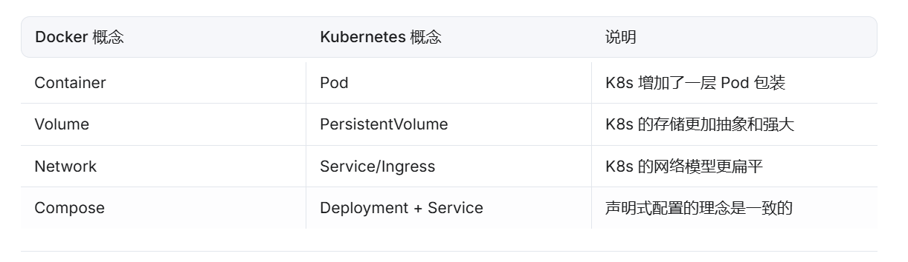

# 核心概念
## Pod
k8s最小的调度单位。一个Pod可以包含一个或多个紧密协作的容器（共享网络和存储）。
## Node
运行 Pod 的物理机或虚拟机。
## Development
定义应用的期望状态 (如：需要 3 个副本，镜像版本为 v1)。K8s 会持续确保当前状态符合期望状态。
## Service
定义一组 Pod 的访问策略。提供稳定的 Cluster IP 和 DNS 名称，负责负载均衡。
## Namespace
用于多租户资源隔离。
## 和Docker的概念对比

# 架构
Kubernetes 也是 C/S 架构，由 **Control Plane (控制平面)** 和 **Worker Node (工作节点)** 组成：

- **Control Plane**：负责决策 (API Server，Scheduler，Controller Manager，etcd)
    
- **Worker Node**：负责干活 (Kubelet，Kube-proxy，Container Runtime)