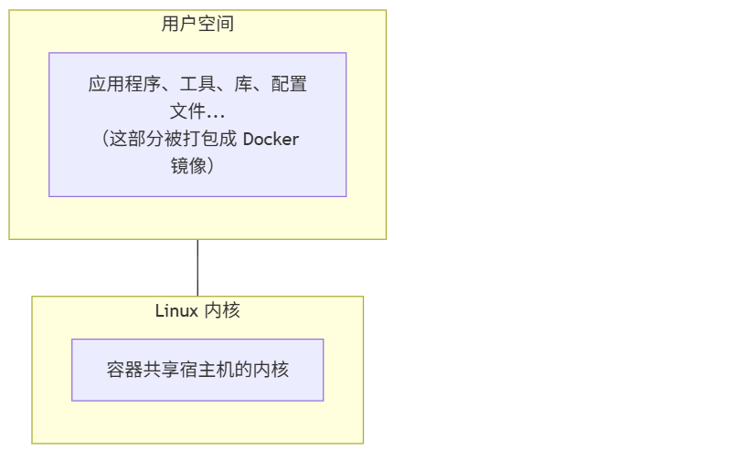
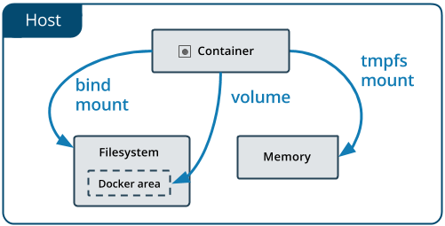

# Docker简介
## Docker 技术基础
Docker 使用 [Go 语言](https://golang.google.cn/)开发，基于 Linux 内核的以下技术：
- [**Namespace**](https://en.wikipedia.org/wiki/Linux_namespaces)：实现资源隔离 (进程、网络、文件系统等)
- [**Cgroups**](https://zh.wikipedia.org/wiki/Cgroups)：实现资源限制 (CPU、内存、I/O 等)
- [**Union FS**](https://en.wikipedia.org/wiki/Union_mount)：实现分层存储 (如 OverlayFS)
## Docker 架构演进
Docker 的底层实现经历了多次演进：
- **LXC** (2013)：Docker 最初基于 Linux Containers
- **libcontainer** (2014，v0.7)：Docker 自研的容器运行时
- **runC** (2015，v1.11)：捐献给 OCI 的标准容器运行时
- **containerd**：高级容器运行时，管理容器生命周期


Docker 架构
> `runc` 是一个 Linux 命令行工具，用于根据 [OCI 容器运行时规范](https://github.com/opencontainers/runtime-spec)创建和运行容器。
> `containerd` 是一个守护程序，它管理容器生命周期，提供了在一个节点上执行容器和管理镜像的最小功能集。

# 基本概念
**Docker** 包括三个基本概念：
- **镜像** (`Image`)：Docker 镜像是一个特殊的文件系统，除了提供容器运行时所需的程序、库、资源、配置等文件外，还包含了一些为运行时准备的一些配置参数 (如匿名卷、环境变量、用户等)。镜像不包含任何动态数据，其内容在构建之后也不会被改变。
- **容器** (`Container`)：镜像 (`Image`) 和容器 (`Container`) 的关系，就像是面向对象程序设计中的 `类` 和 `实例` 一样，镜像是静态的定义，容器是镜像运行时的实体。容器可以被创建、启动、停止、删除、暂停等。
- **仓库** (`Repository`)：镜像构建完成后，可以很容易的在当前宿主机上运行，但是，如果需要在其它服务器上使用这个镜像，我们就需要一个集中的存储、分发镜像的服务，Docker Registry 就是这样的服务。
## 镜像
### 镜像与操作系统的关系
我们都知道，操作系统分为 **内核** 和 **用户空间**：

对于 Linux 而言，内核启动后会挂载 `root` 文件系统来提供用户空间支持。**Docker 镜像** 本质上就是一个 `root` 文件系统。
例如，官方镜像 `ubuntu:24.04` 包含了一套完整的 Ubuntu 24.04 最小系统的 root 文件系统——但 **不包含 Linux 内核** (因为容器共享宿主机的内核)。
### 镜像的组成部分

Docker 镜像是一个特殊的文件系统，包含：

| 内容类型     | 示例                      |
| -------- | ----------------------- |
| **程序文件** | 应用二进制文件、Python/Node 解释器 |
| **库文件**  | libc、OpenSSL、各种依赖库      |
| **配置文件** | nginx.conf、my.cnf 等     |
| **环境变量** | PATH、LANG 等预设值          |
| **元数据**  | 启动命令、暴露端口、数据卷定义         |

### 分层存储
### 镜像的标识
格式：`[仓库地址/]仓库名[:标签]`

```
## 完整格式

registry.example.com/myproject/myapp:v1.2.3

## 简写（使用 Docker Hub）

nginx:1.25
ubuntu:24.04

## 省略标签（默认使用 latest）

nginx  # 等同于 nginx:latest
```
### 镜像的来源

| 方式                  | 说明           | 示例                      |
| ------------------- | ------------ | ----------------------- |
| **从 Registry 拉取**   | 最常用的方式       | docker pull nginx       |
| **从 Dockerfile 构建** | 自定义镜像        | docker build -t myapp . |
| **从容器提交**           | 保存容器状态 (不推荐) | docker commit           |
| **从文件导入**           | 离线传输         | docker load < image.tar |


## 容器
## 仓库

# 数据卷

