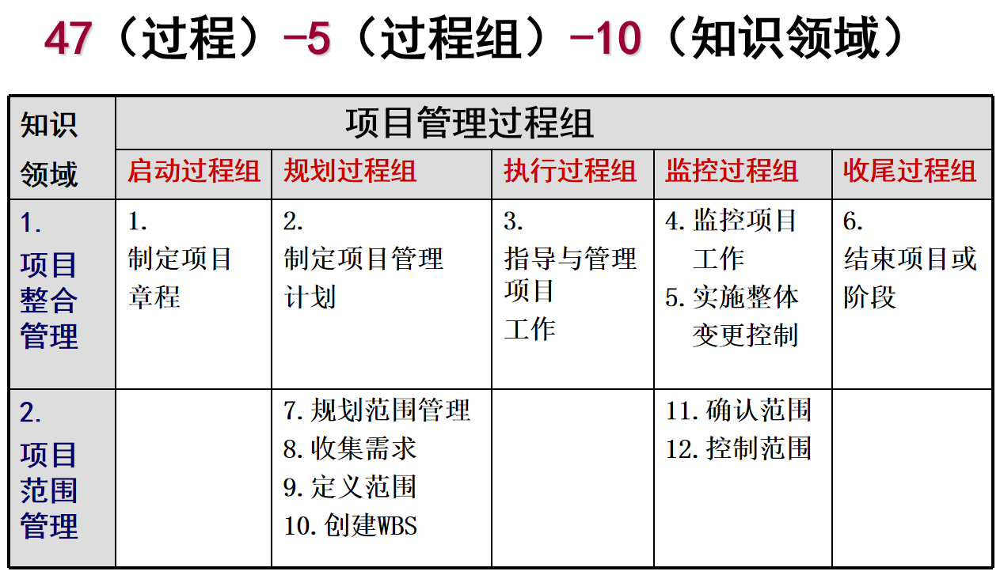
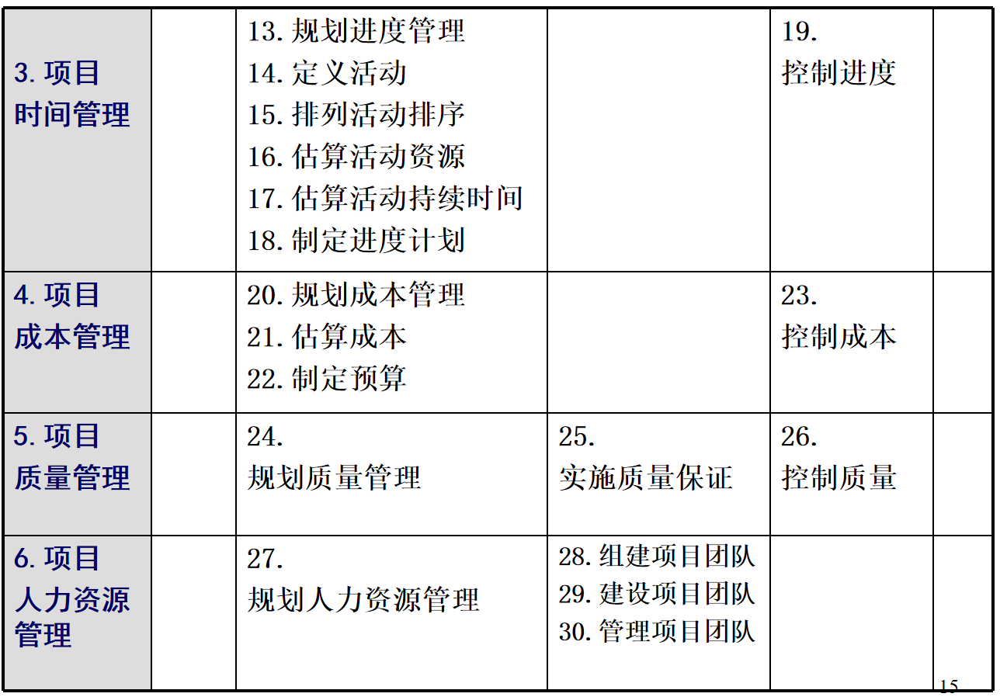
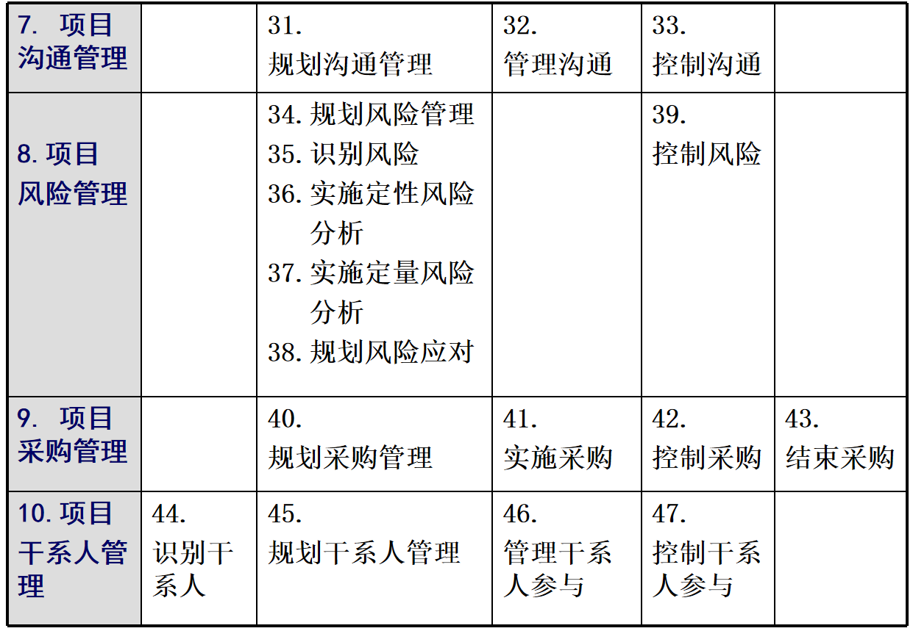
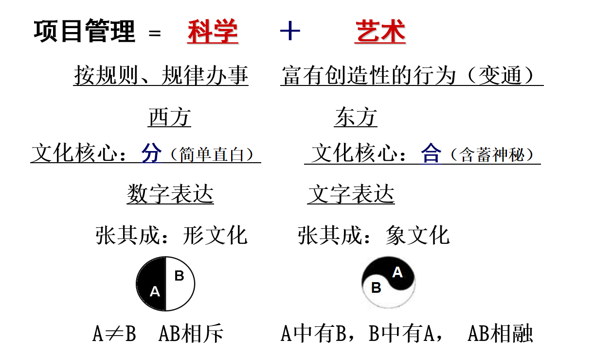
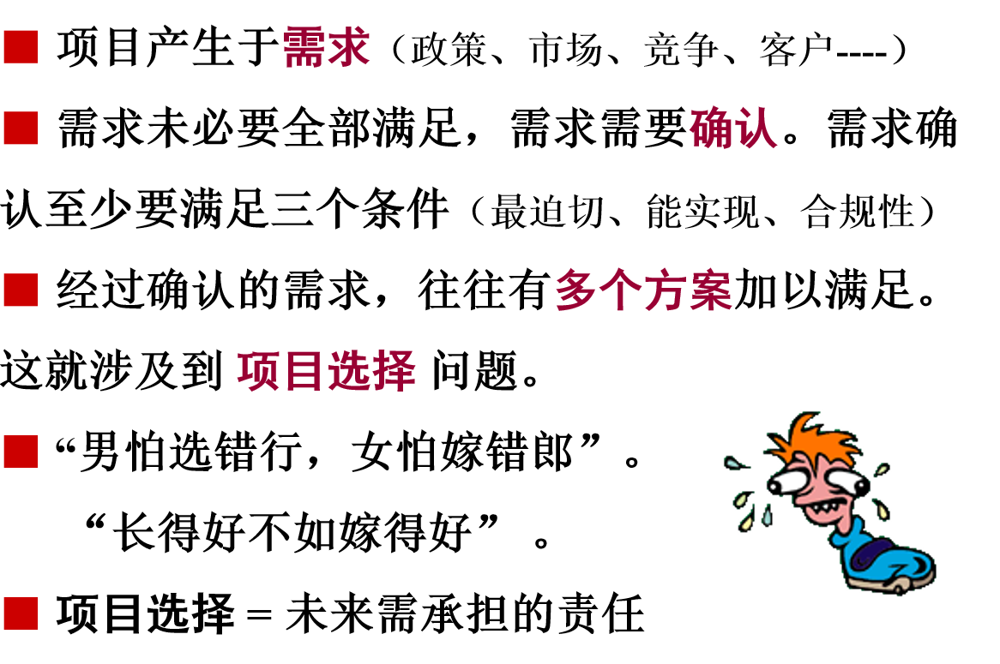
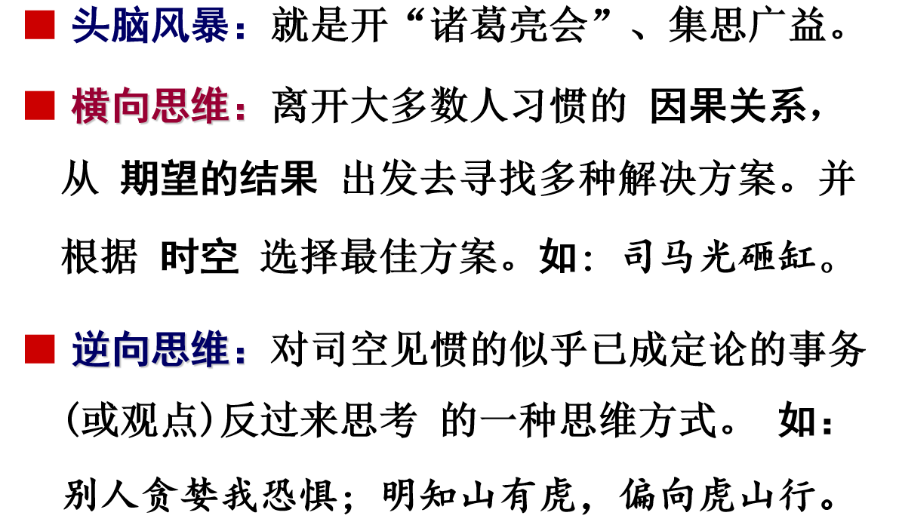

# 引入
项目化经营管理——把事办成 把目标落地 并使成功可复制的学问
项目管理是一门来自西方，专门研究独特（或突发）事务的课程体系。
事务可大可小，大的比如国家级大项目：北京承办奥运会，小的可以到生活的点点滴滴：召集一次同学聚会。
企业大部分事务都是项目运作。
## 项目管理是一门什么课程
项目管理：在期望时间内，在既定成本约束下，把一件独特或突发的的事（范围），一次搞定（质量）的学问。
时间和成本体现做事效率，是否在正确的做事，需要方法和执行力。
范围和质量体现做事效果，是否在做正确的事，需要方向和决策力。

项目管理关注：事前规划与确认，事中执行与监控，事后验证与评价
## 项目管理体系包括哪些内容

# 项目化经营管理之道
## 什么是项目
美国项目管理协会PMI(Project Management Institute)的定义：
项目是为创造独特产品、服务或结果而进行的临时性一次性工作。
基本特征:独特性、一次性、逐渐完善性。
## 什么是项目管理
PMI:
项目管理：将知识、技能、工具与技术运用与各种项目，以达到项目要求。
## 什么是项目化经营管理之道

# 项目立项

## 多方案生成“技术”
