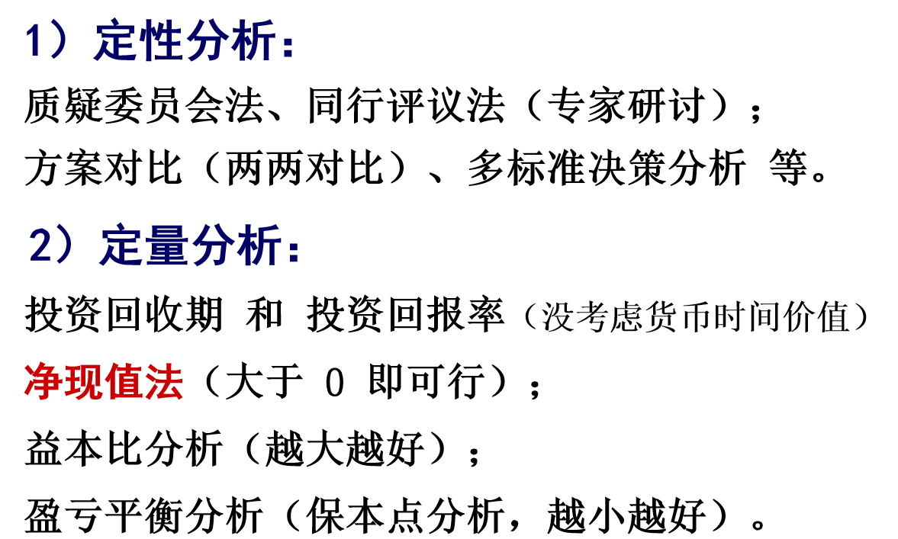
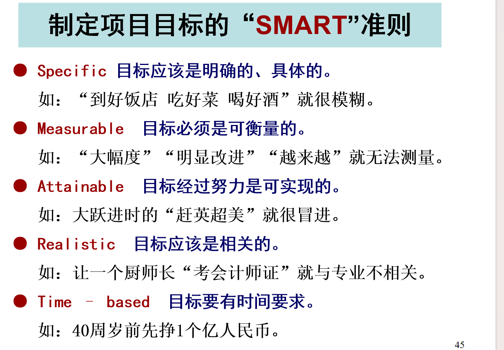
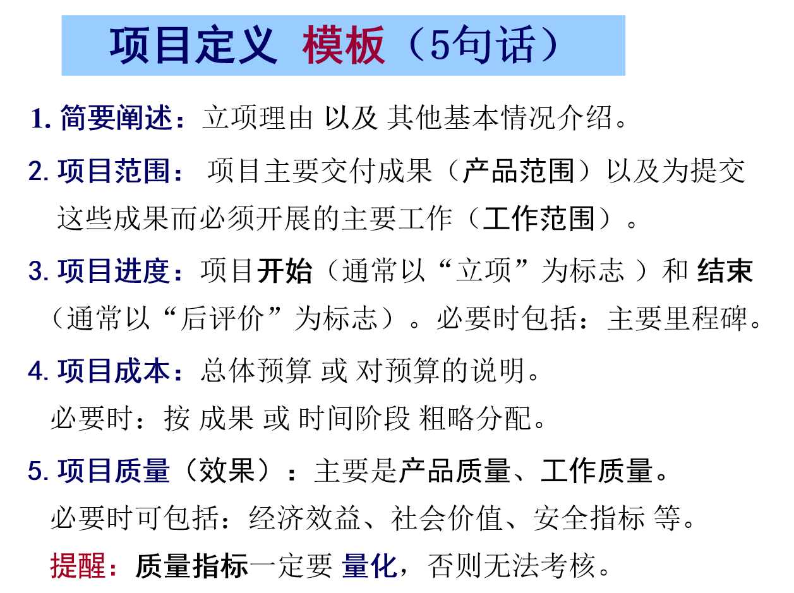
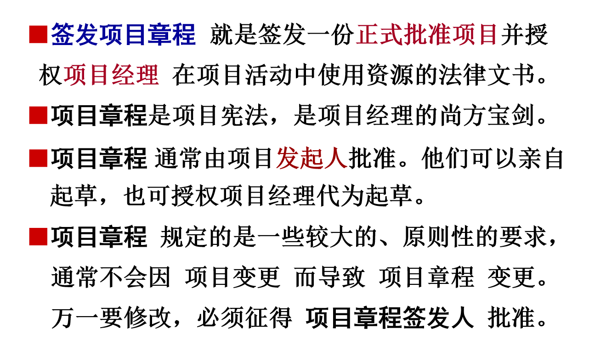
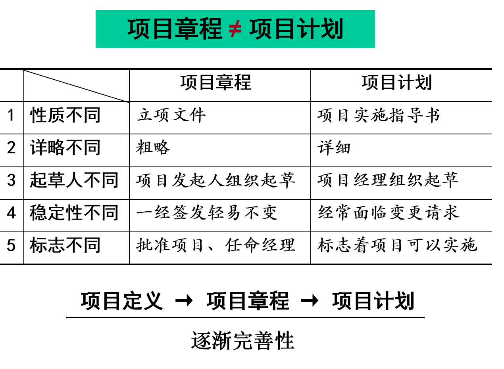
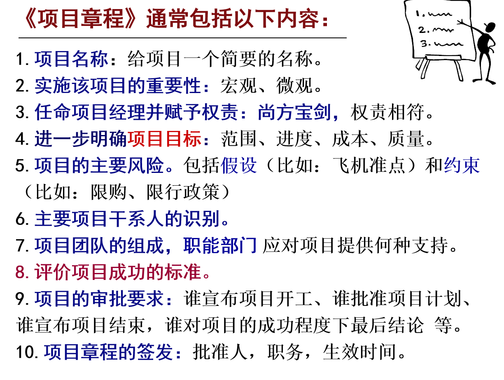
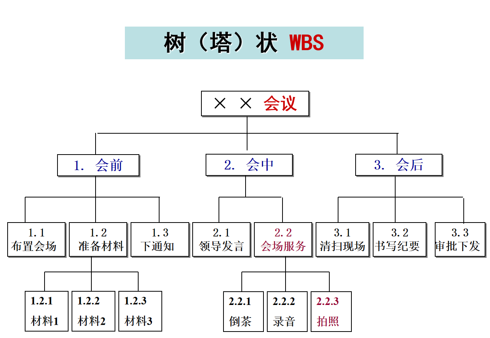
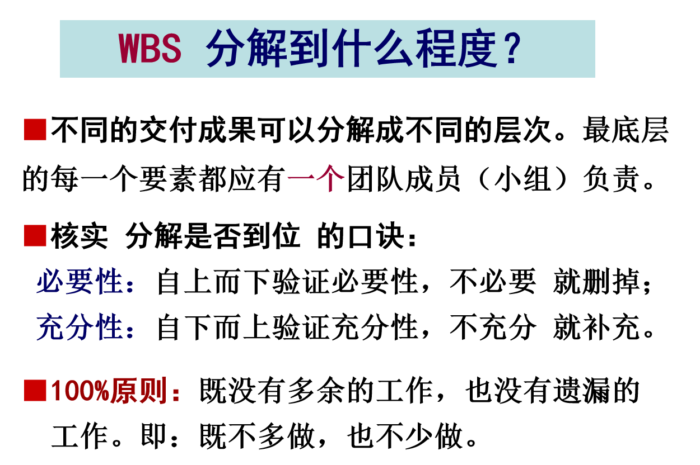
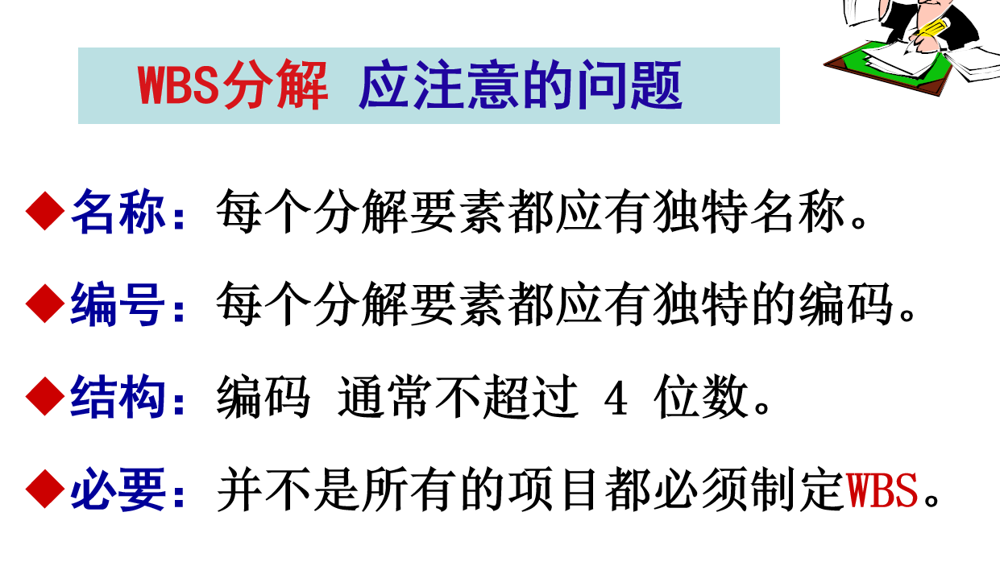
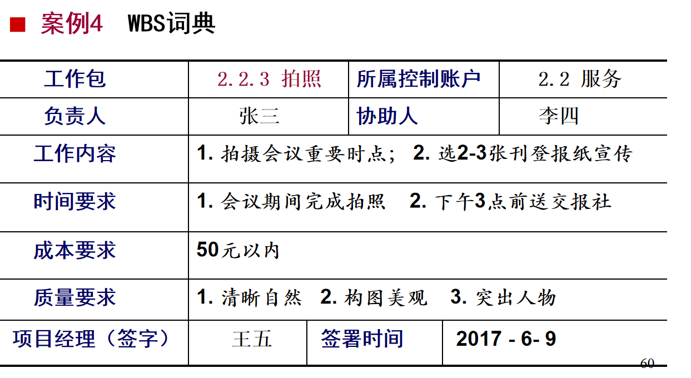

# 引入
项目化经营管理——把事办成 把目标落地 并使成功可复制的学问
项目管理是一门来自西方，专门研究独特（或突发）事务的课程体系。
事务可大可小，大的比如国家级大项目：北京承办奥运会，小的可以到生活的点点滴滴：召集一次同学聚会。
企业大部分事务都是项目运作。
## 项目管理是一门什么课程
项目管理：在期望时间内，在既定成本约束下，把一件独特或突发的的事（范围），一次搞定（质量）的学问。
时间和成本体现做事效率，是否在正确的做事，需要方法和执行力。
范围和质量体现做事效果，是否在做正确的事，需要方向和决策力。

项目管理关注：事前规划与确认，事中执行与监控，事后验证与评价
## 项目管理体系包括哪些内容

# 项目化经营管理之道
## 什么是项目
美国项目管理协会PMI(Project Management Institute)的定义：
项目是为创造独特产品、服务或结果而进行的临时性一次性工作。
基本特征:独特性、一次性、逐渐完善性。
## 什么是项目管理
PMI:
项目管理：将知识、技能、工具与技术运用与各种项目，以达到项目要求。
## 什么是项目化经营管理之道

# 项目立项

## 多方案生成“技术”

## 项目选择方法

## 项目定义

## 签发项目章程

## 项目管理总体流程

# 项目计划
项目计划主要涉及：范围、进度、成本、质量、人资、沟通、风险、采购、干系人、变更等，10个方面。
## 范围计划
范围计划：对项目必须完成的可交付成果以及为此必须开展的工作进行详细规划。
范围计划 包括 以下三份文件：
 ◎ 范围说明书
 ◎ 工作分解结构（WBS）
 ◎ 工作分解结构（WBS）词典(解读)
### 范围说明书
内容包括但不限于：
1.产品范围：对项目主要交付成果（功能、特征）以及其他交付成果（说明书、配套品）的描述。
2.工作范围：为提交产品必须进行的主要工作。
3.产品（服务、成果）通过验收的标准。
4.除外责任：识别哪些责任排除在项目之外。如：
免费停车但不负责保管财物；学费5万不包食宿。
5.假设、约束：会导致产品范围或工作范围改变。比如，航班取消改坐高铁 会引起工作范围改变；必须加装定位系统 会让ofo重新设计共享单车。 
### 工作分解结构（WBS）
工作分解结构：就是把项目的最终产品，分解成便于管理和控制的较小的可交付成果，并进一步分解成一项一项的具体活动。通过各项活动的完成，保证各可交付成果的提交；通过各可交付成果的提交，保证项目最终产品的实现。

>注意：
  按照PMI要求， WBS的第二个层次应该分解成“交付成果”。但从实用角度，也可分解成时间阶段、职能部门 或 主要活动。
>按照PMI要求，把“可交付成果”分解成“较小的可交付成果”叫“创建WBS”。把“较小的可交付成果”继续分解成“具体的活动”叫“定义活动”。理论是

### 工作分解结构（WBS）词典(解读)
WBS词典：是对“工作分解结构”中的每一个要素进行解释。WBS 相当于名词汇编，WBS词典 相当于名词解释。

## 进度计划
编制进度计划，要把可以 同时进行 的活动尽量同时进行（并联），并找出 关键路径，从而确定完成项目的 最短工期。
