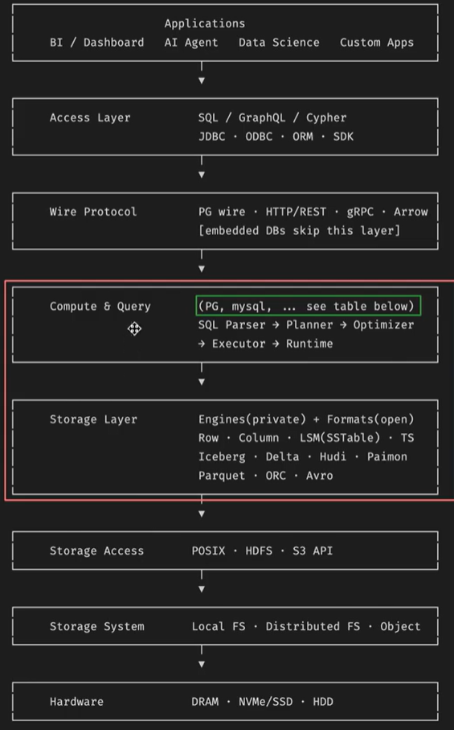
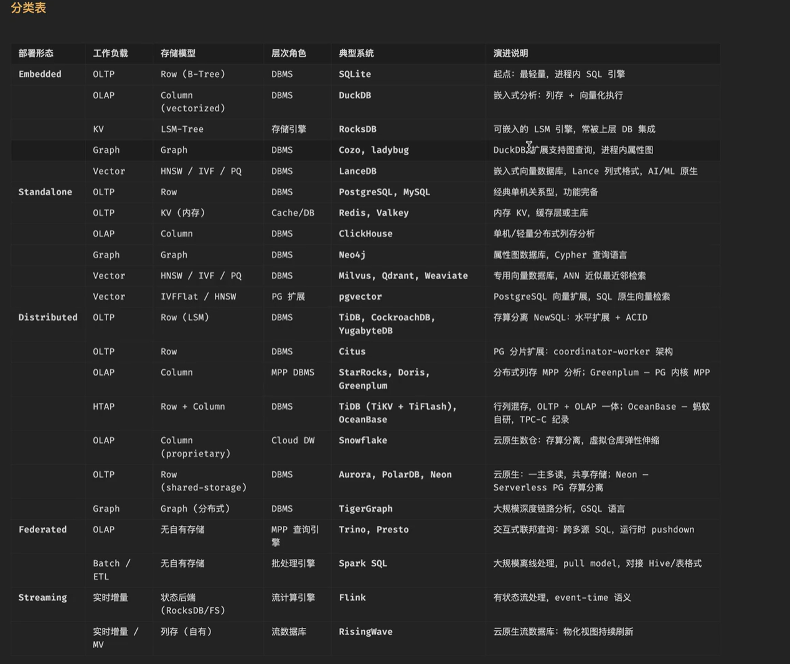
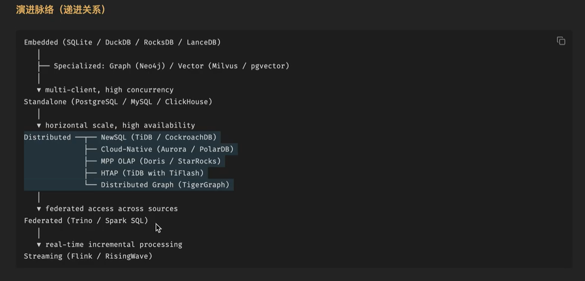
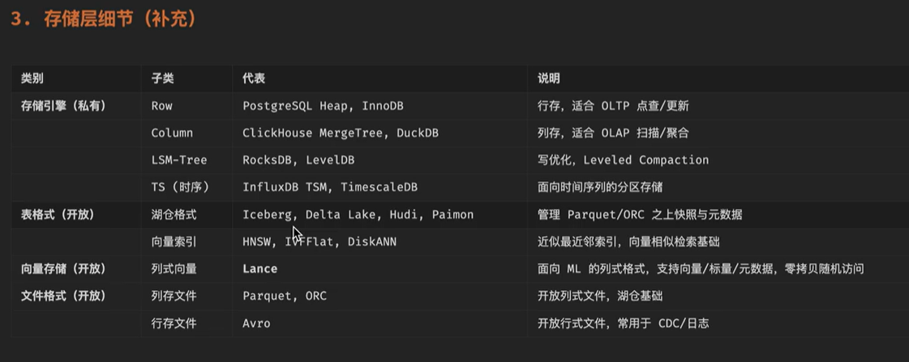

- OLTP(Online Transaction Processing)：日常业务运行的数据库，如PgSQL
- OLAP(Online Analytical Processing)：在线分析处理
- HTAP(Hybrid Transaction Analytical Processing)：混合事务分析处理
- Lakehouse：湖仓一体
- Raw Data Lake：原始数据湖
# 分层架构概览

# 分类表

# 演进脉络

# 存储层细节

