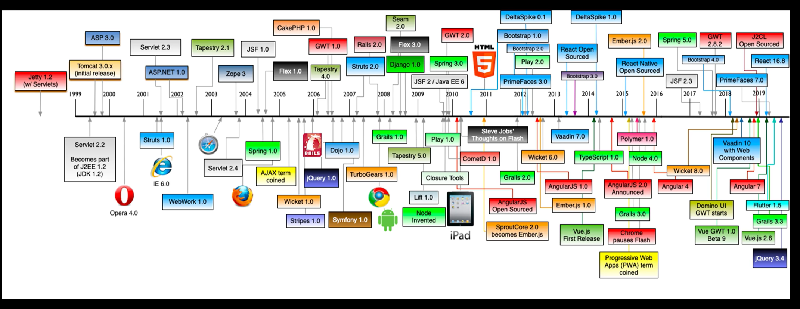
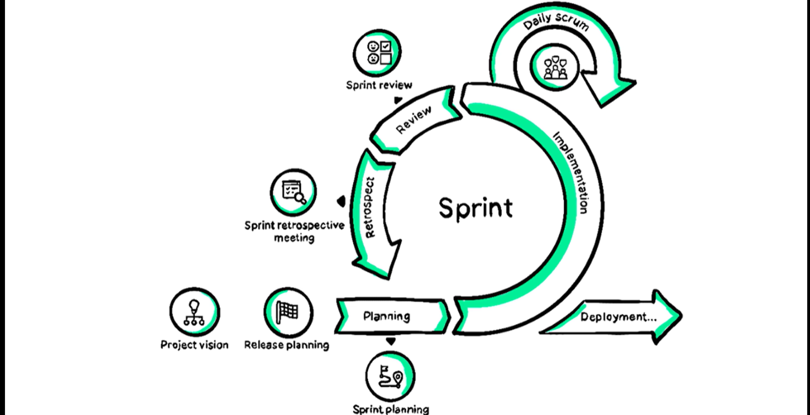

selenium：游览器自动化框架
爬虫技术的迭代，到AI时代爬虫的终结。
3M原则：
Make it work
Make it right
Make it fast
技术栈不是越大越好，而是越小越好
做加法而不是做减法
一个编程语言的生态才是它最大的财富
systemd：

不可控的更新带来了不可控的风险（系统安全边界，供应链投毒）

技术永远要为业务让步，业务永远要为用户服务
Web技术发展时间轴：

