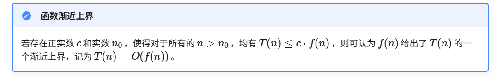
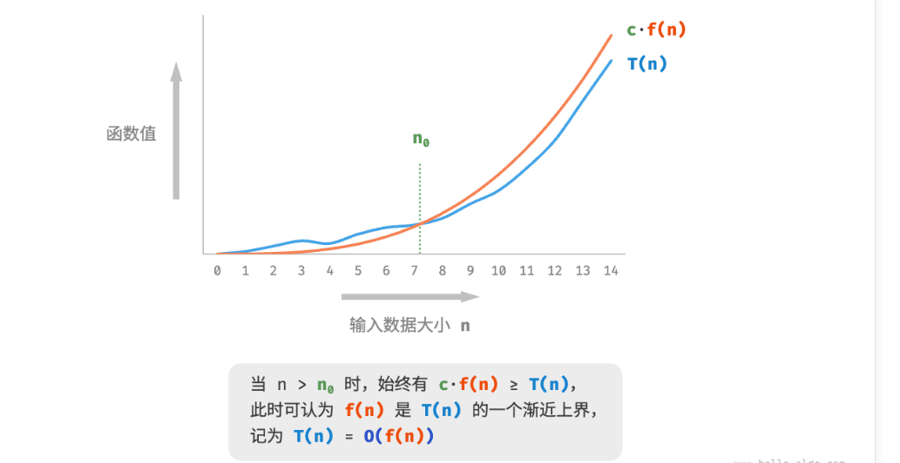
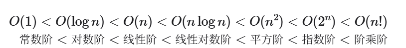
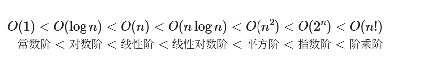

由于实际测试具有较大的局限性，我们可以考虑仅通过一些计算来评估算法的效率。这种估算方法被称为渐近复杂度分析（asymptotic complexity analysis），简称复杂度分析。
复杂度分析能够体现算法运行所需的时间和空间资源与输入数据规模之间的关系。**它描述了随着输入数据规模的增加，算法执行所需时间和空间的增长趋势**。
## 时间复杂度：函数渐进上界
```ts
function algorithm(n: number): void{
    var a: number = 1; // +1
    a += 1; // +1
    a *= 2; // +1
    // 循环 n 次
    for(let i = 0; i < n; i++){ // +1（每轮都执行 i ++）
        console.log(0); // +1
    }
}
```
算法的操作数量是一个关于输入数据大小n 的函数，记为T(n) ，则以上函数的操作数量为：

我们将线性阶的时间复杂度记为O(n)，这个数学符号称为大O 记号（big- notation），表示函数T(n)  的渐近上界（asymptotic upper bound）。
时间复杂度分析本质上是计算“操作数量T(n) ”的渐近上界，它具有明确的数学定义。


### 常见类型

## 推算方法
### 1.统计操作数量
1. 忽略T(n)中的常数、系数
2. 循环嵌套使用乘法
### 2.判断渐进上界

## 常见类型

## 最差、最佳、平均时间复杂度