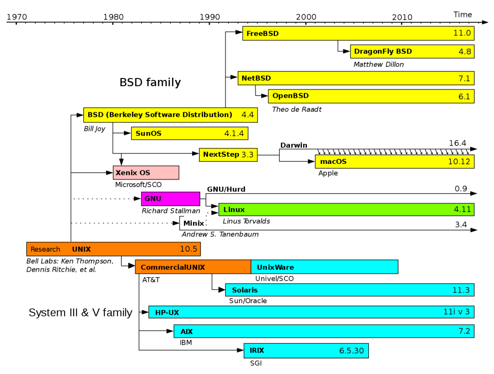

# Linux生态
## GNU
```
GNU's Not Unix
```
GNU 项目的目标是：

> 做出一套类似 Unix 的、完全自由的软件系统。

它里面有很多经典工具，比如：

```
GCC 编译器套件  
GDB 调试器  
Bash Shell  
make 构建工具  
glibc C 标准库实现  
coreutils 常用命令，如 ls、cp、mv、rm  
binutils 汇编器、链接器等工具
```

```
Linux：内核
GNU：大量系统工具和开发工具
GNU/Linux：Linux 内核 + GNU 用户态工具组成的完整系统
```
## LLVM
**LLVM** 最初的名字来自：

```
Low Level Virtual Machine
```

但现在它已经不再只是“虚拟机”，而是一个大型的**编译器基础设施项目**。

你可以把 LLVM 理解成：

> 一套用来构建编译器、优化器、代码生成器、静态分析工具的底层框架。

它里面最有名的是：

```
Clang        C/C++/Objective-C 编译器前端
LLVM Core    中间表示 IR、优化器、后端代码生成
LLD          链接器
LLDB         调试器
libc++       C++ 标准库实现
compiler-rt  运行时库
```

## 操作系统家谱

# 基础语法
## 数据类型

对于通常表示数值的类型，重点是关注它的范围大小，因为C语言数据类型的大小是不完全固定的，在不同的硬件平台，会有区别，尤其是一些嵌入式设备。下面给出一个通常情况下的表示范围

> 补充说明： 在C99新标准中，对C语言进行了扩展，其中提供了几种新的类型

1. 新增复数类型（`_Complex`）和虚数类型（`_Imaginary`）
    
2. 新增布尔类型（`_Bool`，包含`＜stdbool.h＞`头文件时，可以使用`bool`来代替`_Bool`）
    
3. 新增整数类型`long long int`，该类型用于表示64位整数，共8字节，请注意与C++中的`long long`区分
### 修饰数值类型
```C
unsigned int len = 10;
```
### 基本数据类型的打印
- `%d` 有符号十进制整数
- `%f` 浮点数
- `%s` 字符串
- `%c` 单个字符
- `%x` 十六进制整数
### 获取数据类型的长度
```C
#include<stdio.h>  
  
int main(void){  
    printf("char size = %d\n",sizeof(char));  
    printf("short size = %d\n",sizeof(short));  
    printf("int size = %d\n",sizeof(int));  
    printf("long size = %d\n",sizeof(long));  
    printf("float size = %d\n",sizeof(float));  
    printf("double size = %d\n",sizeof(double));  
}
```
### 常量
```C
const int PI = 3.14;
```
```C
#include<stdio.h>  
  
// 定义一个宏 PI  
#define PI 3.14  
  
int main(void){  
    printf("%f",PI);  
}
```

> 拓展：C语言中int的正确使用姿势

由于C语言中，整型的实际长度和范围不固定的问题，会导致C语言存跨平台移植的兼容问题，因此，C99标准中引入了`stdint.h`头文件，有效的解决了该问题。
```C
#include<stdio.h>  
#include<stdint.h>  
  
int main(void){  
    // 使用stdint.h中定义的类型表示整数  
    int8_t a = 0;  
    int16_t b = 0;  
    int32_t c = 0;  
    int64_t d = 0;  
  
    // 前面加u，表示unsigned,无符号  
    uint32_t e = 0;  
    printf("int8 size is %d\n",sizeof(int8_t));  
    printf("int16 size is %d\n",sizeof(int16_t));  
    printf("int32 size is %d\n",sizeof(int32_t));  
    printf("int64 size is %d\n",sizeof(int64_t));  
    printf("uint32 size is %d\n",sizeof(uint32_t));  
}
```
## 算术运算符
C语言进行数值运算时=也存在自动类型转换，且从大转小也是隐式的。
### 运算符优先级

算术运算符 > 关系运算符 > 逻辑运算符 > 赋值运算符。逻辑运算符中逻辑非 `!`除外

| 优先级    | 运算符      | 名称或含义               | 使用形式             | 结合方向 | 说明    |
| ------ | -------- | ------------------- | ---------------- | ---- | ----- |
| 1      | []       | 数组下标                | 数组名[常量表达式]       | 左到右  |       |
| ()     | 圆括号      | (表达式)  <br>函数名(形参表) |                  |      |       |
| .      | 成员选择（对象） | 对象.成员名              |                  |      |       |
| ->     | 成员选择（指针） | 对象指针->成员名           |                  |      |       |
| 2      | -        | 负号运算符               | -表达式             | 右到左  | 单目运算符 |
| (类型)   | 强制类型转换   | (数据类型)表达式           |                  |      |       |
| ++     | 自增运算符    | ++变量名  <br>变量名++    | 单目运算符            |      |       |
| --     | 自减运算符    | --变量名  <br>变量名--    | 单目运算符            |      |       |
| *      | 取值运算符    | *指针变量               | 单目运算符            |      |       |
| &      | 取地址运算符   | &变量名                | 单目运算符            |      |       |
| !      | 逻辑非运算符   | !表达式                | 单目运算符            |      |       |
| ~      | 按位取反运算符  | ~表达式                | 单目运算符            |      |       |
| sizeof | 长度运算符    | sizeof(表达式)         |                  |      |       |
| 3      | /        | 除                   | 表达式 / 表达式        | 左到右  | 双目运算符 |
| *      | 乘        | 表达式*表达式             | 双目运算符            |      |       |
| %      | 余数（取模）   | 整型表达式%整型表达式         | 双目运算符            |      |       |
| 4      | +        | 加                   | 表达式+表达式          | 左到右  | 双目运算符 |
| -      | 减        | 表达式-表达式             | 双目运算符            |      |       |
| 5      | <<       | 左移                  | 变量<<表达式          | 左到右  | 双目运算符 |
| >>     | 右移       | 变量>>表达式             | 双目运算符            |      |       |
| 6      | >        | 大于                  | 表达式>表达式          | 左到右  | 双目运算符 |
| >=     | 大于等于     | 表达式>=表达式            | 双目运算符            |      |       |
| <      | 小于       | 表达式<表达式             | 双目运算符            |      |       |
| <=     | 小于等于     | 表达式<=表达式            | 双目运算符            |      |       |
| 7      | ==       | 等于                  | 表达式==表达式         | 左到右  | 双目运算符 |
| !=     | 不等于      | 表达式!= 表达式           | 双目运算符            |      |       |
| 8      | &        | 按位与                 | 表达式&表达式          | 左到右  | 双目运算符 |
| 9      | ^        | 按位异或                | 表达式^表达式          | 左到右  | 双目运算符 |
| 10     | \|       | 按位或                 | 表达式\|表达式         | 左到右  | 双目运算符 |
| 11     | &&       | 逻辑与                 | 表达式&&表达式         | 左到右  | 双目运算符 |
| 12     | \|       | 逻辑或                 | 表达式\|表达式         | 左到右  | 双目运算符 |
| 13     | ?:       | 条件运算符               | 表达式1? 表达式2: 表达式3 | 右到左  | 三目运算符 |
| 14     | =        | 赋值运算符               | 变量=表达式           | 右到左  |       |
| /=     | 除后赋值     | 变量/=表达式             |                  |      |       |
| *=     | 乘后赋值     | 变量*=表达式             |                  |      |       |
| %=     | 取模后赋值    | 变量%=表达式             |                  |      |       |
| +=     | 加后赋值     | 变量+=表达式             |                  |      |       |
| -=     | 减后赋值     | 变量-=表达式             |                  |      |       |
| <<=    | 左移后赋值    | 变量<<=表达式            |                  |      |       |
| >>=    | 右移后赋值    | 变量>>=表达式            |                  |      |       |
| &=     | 按位与后赋值   | 变量&=表达式             |                  |      |       |
| ^=     | 按位异或后赋值  | 变量^=表达式             |                  |      |       |
| \|=    | 按位或后赋值   | 变量\|=表达式            |                  |      |       |
| 15     | ,        | 逗号运算符               | 表达式,表达式,…        | 左到右  |       |

**「常见运算符优先级问题」**

| 优先级问题                           | 表达式                    | 错误认识                     | 实际结果                     |
| ------------------------------- | ---------------------- | ------------------------ | ------------------------ |
| `.` 的优先级高于`*`（`->` 操作符用于消除这个问题） | `*p.f`                 | `(*p).f`                 | `*(p.f)`                 |
| `[]` 高于 `*`                     | `int *ap[]`            | `int (*ap)[]`            | `int *(ap [])`           |
| 函数`()` 高于 `*`                   | `int *fp()`            | `int (*fp)()`            | `int* ( fp() )`          |
| `==` 和 `!=` 高于位操作               | `(val & mask != 0)`    | `(val & mask) != 0`      | `val & (mask != 0)`      |
| `==` 和 `!=` 高于赋值符               | `c = getchar() != EOF` | `(c = getchar()) != EOF` | `c = (getchar() != EOF)` |
| 算术运算符高于位移运算符                    | `msb << 4 + lsb`       | `(msb << 4) + lsb`       | `msb << (4 + lsb)`       |
| 逗号运算符在所有运算符中优先级最低               | `i = 1, 2`             | `i = (1,2)`              | `(i = 1), 2`             |
|                                 |                        |                          |                          |
## 条件分支与循环
### 条件分支
C语言使用0和非0表示false和true。
```C
if(/*条件1*/){  
    //语句块1  
} else  if(/*条件2*/){  
    //语句块2  
} else  if(/*条件3*/){  
    //语句块3  
}else{  
     //语句块n  
}
```
case后面必须是一个整数或者是返回值为整数的不含任何变量的表达式。
如果case下面的语言有声明变量则必须使用{}包起来。
```C
int a = 1;  
  
switch(a){  
        case 1:   
         printf("Monday\n");   
         break;  
        case 2:   
         printf("Tuesday\n");   
         break;  
        case 3:   
         printf("Wednesday\n");   
         break;  
        case 4:   
         printf("Thursday\n");   
         break;  
        case 5:   
         printf("Friday\n");   
         break;  
        case 6:   
         printf("Saturday\n");   
         break;  
        case 7:   
         printf("Sunday\n");   
         break;  
        default:  
         printf("error\n");   
         break;  
    }

```
### 控制循环
```C
int i=1, sum=0;  
while(1){  //死循环  
    sum+=i;  
    i++;  
    if(i>100) break;  //满足条件退出循环  
}

// 打印奇数  
for(int i=1; i<=100; i++){  
    if(i%2 == 0){   // 遇到偶数时跳过  
     continue;  
    }  
    printf("%d\n",i);  
}
```
## 简单数组
把具有相同类型的若干个数据按一定顺序组织起来，这些同类数据元素的集合就称为「数组」。数组元素可以是基本数据类型，也可以是结构体类型。
### 计算数组长度
```C
int a[6] = {12,4,5,6,7,8};  
  
// 计算数组长度。数组总内存大小/每个元素内存大小  
int len = sizeof(a)/sizeof(int);  
for(int i=0;i<len;i++){  
 printf("%d \n",a[i]);  
}
```
### 数组与指针
> 数组名在大多数表达式中会转化为指针，但是数组本身不是指针

1、数组和指针是不同的数据类型
```C
char arr[] = "Hello";//这里的arr 是char[5]类型。
char *p = arr;//这里的p是char *类型。
```
2、 在大多数表达式里数组名会自动转成指向首元素的指针，但sizeof不会转换
```C
char str[] = "Hello,ALICE";  
  
convstr(str, 0);
// 在调用函数时，str会转成&str[0]
```
3、函数形参里的char arr[]本质是char * arr

```C
// 对于下面的函数声明
void convstr(char ch[], int flags)
// 编译器会调整为
void convstr(char *ch, int flags)
```
4、arr[i] 本质是语法糖，会被编译器编译为* (arr + i)
5、数组名不能被重新赋值，但指针变量可以。
6、&str和str不同
```C
char str[] = "abc";
// 单从值来看两者可能相同，都是指向首元素的地址
// str可能会退化为char *类型，而&str则是char (*)[4]类型，意思是指向整个char[4]的数组
// 对应的指针运算也不一样
str + 1 //跳过一个char
&str + 1 //跳过整个char[4]数组
```
## 字符串
```C
  // 省略数组长度，并使用字符串字面量初始化  
    char str5[] = "hello world";
```
### 初始化
```C
#include <stdio.h>  
#include <string.h>   // 需要包含string.h头文件  

int main(){  
 char str[20];  
 // 将数组初始化化为指定的值，这里指定0，第三个参数是数组的内存大小  
 memset(str, 0, sizeof(str));  
  
 str[0] = 'a';  
 str[1] = 'b';  
 str[2] = 'c';  
  
 printf("%s", str);  
  
 return 0;  
}
```
### 字符串与普通数组的区别
在C语言中，虽说字符串是用字符数组来表示的，但是字符串和普通字符数组仍然是不同的，这两者的区别可以简单总结为如下三点
1. C语言字符串规定，结尾必须包含一个特殊字符`'\0'`，我们查询一下`ASCII`表可知，该字符属于控制字符，即无法打印显示出来的字符，它在`ASCII`表中的编号是0，即表中的第一个字符`NUL`。
2. 字符串的实际长度（即字符的个数）比字符数组的长度小1。
3. 声明的同时，数组只能使用花括号初始化，而字符串可以使用双引号括起来的字面量初始化。

### 指针与字符串
只有字符串指针能用%s直接输出字符串内容，不需要解引用，当然其他场景还是需要。
字符串数组也可以，注意字符串数组是数组类型。
同时字符串指针指向的字符串是常量，不能修改某一个字符的值，但是字符串数组可以。
由于【】是语法糖，所以实际即使是字符串指针也可以用[i]访问某个位置的字符。
```C
#include <stdio.h>  
  
int main(){  
    // 使用字符串指针表示字符串  
    char *greet = "hello, Alex";  
  
    printf("address=%x\n",greet);  
    printf("%s\n",greet);  
    return 0;  
}
```
结果：
```C
address=404000  
hello, Alex
```
### 常用函数
字符串长度
strlen，和使用sizeof计算的区别是不会算上尾部的特殊字符
```C
#include <stdio.h>  
#include <string.h>  
  
int main(void){  
    char str[]= "hello world!";  
  
    // 动态计算str数组的长度  
    printf("array size is %d\n",sizeof(str)/sizeof(char));  
  
    // 获取字符串的长度  
    int len = strlen(str);  
    printf("string size is %d\n",len);  
  
    return 0;  
}
```
比较内容
strcmp
```C
#include <stdio.h>  
#include <string.h>  
  
int main(void){  
    char str1[]= "hello";  
    char str2[]= "hello";  
  
 // strcmp的返回值等于0时，表示两个字符串内容相同，否则不同  
    if (strcmp(str1,str2) == 0){  
       printf("str1 == str2\n");  
    }else{  
        printf("str1 != str2\n");  
    }  
  
    char str3[]= "bruce";  
    char str4[]= "hello";  
  
    if (strcmp(str3,str4) == 0){  
       printf("str1 == str2\n");  
    }else{  
        printf("str1 != str2\n");  
    }  
  
    return 0;  
}
```
字符串复制
strncpy  还可使用该函数为字符数组进行初始化
```C
#include <stdio.h>  
#include <string.h>  
  
int main(void){  
    char str1[100]={0};  
      
    // 将字符串复制到指定的字符数组中，并自动复制结束符。第一个参数就是目的地  
    // 第三个参数需指定复制的长度，这里指定目标数组的大小，表示如果超过这个长度则以这个长度为止  
    strncpy(str1,"Greetings from C",sizeof(str1));  
    printf("str1=%s\n",str1);  
    // 第二个参数最好-1强制为结束符留下位置，否则复制的字符串如果超出目的数组大小就会没有结束符，造成不可预知的错误
  
    // 将str1的内容复制到str2中  
    char str2[50]={0};  
    strncpy(str2,str1,sizeof(str2));  
    printf("str2=%s\n",str2);  
    return 0;  
}
```
字符串拼接
strncat，和strncpy一样有结束符问题，建议留一个空间。
```C
#include <stdio.h>  
#include <string.h>  
  
int main(void){  
    char str1[100] = "hello";  
      
    // 将第二个参数的内容追加到第一个参数的后面，相当于将两者拼接  
    // 第三个参数为拷贝的长度，类似strncpy，  
    // 这里计算数组的总长度减去字符串的长度，求得str1剩余空间的长度  
    strncat(str1," world!",sizeof(str1)/sizeof(char)-strlen(str1));  
    printf("str1=%s\n",str1);  
  
    return 0;  
}
```
## 简单函数
当没有写函数返回值类型时默认返回int。
```C
返回值类型 函数名(形式参数){  
  函数体  
}
```
### 函数声明
当没有声明直接定义时一般定义就包含了声明。
当没有声明也没有定义就调用时一些编译器会进行【隐式声明】，将返回值设置为int，这时如果下面再进行了定义或声明时就会报「重定义了不同的类型」错误
```C
#include <stdio.h>  
  
// 在main函数之前先声明  
void printError();  
  
int main(){  
    printError();  
    return 0;  
}  
  
// 在main函数之后再定义  
void printError(){  
    printf("this is error!\n");  
}
```
### 函数作用域
局部变量：在函数中声明的变量。
全局变量：函数外声明的变量，在任何文件都可以访问。
### 参数传递
C语言的函数实参与形参都是值传递。

```C
#include <stdio.h>  
#include <string.h>  
  
/*  
    当数组作为形参时，不能对其使用sizeof运算符  
    flags: 值为0时，全部转小写，非0时，转大写  
*/  
void convstr(char ch[], int flags){  
    for (int i = 0; i < strlen(ch); i++){  
        if (ch[i] >= 97 && ch[i] <= 122){   
            if(flags) ch[i] = ch[i] - 32;  
        }else if (ch[i] >= 65 && ch[i] <= 90){  
            if(!flags) ch[i] = ch[i] + 32;  
        }  
    }  
}  
  
  
int main(){  
    char str[] = "Hello,ALICE";  
  
    convstr(str,0);  
    printf("%s",str);  
    return 0;  
}
```

### 简单函数小结
1、函数不能返回数组，因此函数的返回值不能是数组类型
2、函数没有返回值时，应该写明void
3、C语言没有函数重载。C语言也没有命名空间。这两者结合就是C语言最大的缺陷之一。
4、C语言函数的声明和定义是分开的，任何时候都应该先声明再使用。声明分为【隐式声明】和【显示声明】，使用前直接定义就是包含了隐式声明。

## 指针
### 指针常量与常量指针

- 指针常量：指针变量本身是个常量，不能指向其他的内存地址。
```C
int* const p1 = &n;
```
- 常量指针：指针变量指向的内容是常量，这时不能使用解引用修改内存内容，但是指针变量本身可以指向其他的内容。
```C
const int *p1 = &n;
```
- 指向常量的指针常量
```C
int n = 7;  
int l = 10;  
  
//声明指向常量的常量指针  
const int* const p1 = &n;  
*p1 = 0; // 错误! 不能修改指向的内容  
p1 = &l; //错误! 不能重新指向新地址
```
### 二维数组
二维数组虽然像一个表格，但是在内存中还是连续的
# 程序结构与作用域
## 局部变量
## 全局变量
1、全局变量声明在所有函数体之外。处于【文件作用域】，全局变量可以被在他之后定义的所有函数使用，但是如果没有加extern关键字的话只能在当前文件访问，函数同理，但是函数默认加extern。
2、编译器会自动将全局变量进行零值初始化，手动初始化时注意右侧只能使用常量表达式进行初始化。
```C
const int minute = 360 -10;  
  
//全局变量必须使用常量表达式初始化  
int hour = minute/60;  
  
// 访问全局变量 minuteint f(int h){  
        //h 是局部变量  
        return h*minute;  
}  
  
int main(){  
        // 局部变量  
        int day=0;  
        return 0;  
}
```
## static关键字
static关键字可以修饰变量和函数。
1、对于静态全局变量，此时static的作用相当于private关键字，只能在当前文件中访问。
2、对于静态局部变量：
- 静态局部变量在程序的整个生命周期都存在，和全局变量放在相同的存储位置。
- 静态局部变量的初始化规则和全局变量一致。
- 静态局部变量只能被声明它的函数访问，但是可以通过把地址返回让其他函数也能访问。
3、对于函数来说，也相当于private，让定义的函数只能在当前文件访问，一定程度上避免了命名冲突问题。
## extern关键字
extern关键字可以作用于变量和函数。
1、对于全局变量，默认只能在文件作用域访问，如果需要能被全局访问，还要加上extern，而在使用时，需要加上extern表示引用全局变量。
2、对于函数声明，一般使用头文件引入，也可以加上extern，不过函数默认都是包含extern的，不需要手动指定。

# 模块化编程
## 头文件
1、头文件就是普通的文本文件
2、头文件和源文件在同一根目录下时“”中使用相对路径即可
3、不在同一根目录下时编译时使用-I指定头文件路径或者设置C_INCLUDE_PATH环境变量即可
4、""和<>只是路径的区别，在同一根目录下应该使用""。否则使用<>
## 预处理
C语言运行前包括四个处理流程：预处理-编译-汇编-链接
预处理作用于编译器，不属于C语言词法
预处理指令都以#开头
### 文件包含
使用include指令包含一个指定文件
include指令的作用就是把头文件的声明都复制到源文件中，这称为【声明展开】
### 宏定义
使用#define指令定义一个宏，使用#undef指令删除一个宏
在预处理环节#define的预处理就是字符串替换
宏不能被定义两次，除非新定义与旧定义完全一样
- 普通宏
```C
#define 标识符 替换列表  
#define PI 3.1514
```
- 带参数的宏
```C
#define 标识符(a,b,c,...,d) 替换列表  
#define MAX(x,y) ((x)>(y)?(x):(y))
```
**「关于小括号的注意事项」**
1. 如果宏替换列表中有运算符号，那么必须将整个替换列表放入小括号中`#define TOW_PI (2*3.14)`
2. 如果宏有参数，那么每个参数在替换列表中出现时，都要放在小括号中`#define MAX(x,y) ((x)>(y)?(x):(y))`
#### 运算符
宏定义包含两个专用运算符`#`和`##`
- `#` 运算符可以用来字符串化宏函数里的参数，它出现在带参数宏的替换列表中。
```C
#define PRINT_INT(n) printf(#n "=%d\n",n)      
PRINT_INT(i/j);   
//宏展开为   
printf("i/j""=%d\n",i/j)   
//等价于（C语言相邻字符串字面量会被合并）   
printf("i/j=%d\n",i/j)   `
```
- `##` 运算符可以将两个记号（如标识符）粘合在一起
```C
#define MK_ID(n) i##n
int MK_ID(1),MK_ID(2);
 //宏展开后   
 int i1,i2;`
```
#### 创建包含多条语句的宏
使用`do-while`编写多条语句宏是一种C语言的技巧。
```C
#define ECHO(s)  \  
    do{          \  
        gets(s); \  
        puts(s); \  
    }while(0)    
      
ECHO(str);  
//宏展开后  
do{gets(str);puts(str);}while(0);
```
#### 预定义宏
|宏|简述|
|---|---|
|_LINE_|当前程序行的行号（十进制整型常量）|
|_FILE_|当前源文件名（字符串型常量 ）|
|_DATE_|编译的日期（表示为Mmm dd yyyy 形式的字符串常量）|
|_TIME_|编译的时间（hh:mm :ss形式的字符串型常量）|
|_STDC_|编译器符合C标准，值为1|
### 条件编译
- if和endif
```C
#define DEBUG 1  
  
/* #if和#endif成对出现，#if后面跟常量表达式，0为false，反之true。当为0时，它们之间的代码在预处理时会被删去 */  
  
// #if后面的标识符如未被定义过时，则当作值为0处理
#if DEBUG  
printf("this is debug!\n");  
#endif
```
- defined
检测其后的标识符是否有定义过，若定义过则返回1，否则返回0
```C
#define DEBUG  
  
#if defined DEBUG  

#endif
```
- ifdef和ifndef
```C
#ifdef 标识符  
  
/* 它等价于以下指令 */  
#if defined 标识符
```
- elif、else
```C
#if 表达式1  
...  
#elif 表达式2  
...  
#else  
...  
#endif
```
# 高级语法
## 结构体
可以将声明的结构体看作基本数据类型，作为实参传递时会复制值而不是退化为指针，这点和数组不一样。
```C
#include <stdio.h>  
// 声明一个结构体  
struct student  
{  
    char *name;  
    int age;  
    char *number;  
    char *grade;  
};  
  
int main(){  
    // 声明结构体变量:stu  
    struct student stu;  
    // 为结构体中的成员赋值  
    stu.name = "zhangsan";  
    stu.age = 19;  
    stu.number = "A010";  
    stu.grade = "18级";   
    // 访问结构体中各个成员变量的内容  
    printf("学生信息：%s,%d,%s,%s\n",stu.name,stu.age,stu.number,stu.grade);  
    return 0;  
}
```
### 初始化
```C
	struct student stu={NULL};  
    struct student stu={.age=18, .name="张三"};  
    printStudent(stu);
```
### 结构体与内存
结构体变量的内存地址和它的第一个成员变量的地址是相同的。
结构体占用的内存大小就等于结构体各个成员变量占用的内存大小之和,但是要考虑内存对齐的情况。
「对齐模数」
```C
// 传入1，指定不做内存对齐，在结束处pack()不传参，恢复内存对齐  
# pragma pack(1)  
struct A  
{  
    char b;  
    int a;  
    short c;  
};  
# pragma pack()
```
**「结构体内存对齐规则」**

- 第一个成员在结构体变量偏移量为0 的地址处
    
- 其他成员变量要对齐到某个数字（对齐模数）的整数倍的地址处
    
- 结构体总大小为最大对齐数的整数倍。（每个成员变量都有自己的对齐数）
    
- 如果嵌套结构体，嵌套的结构体对齐到自己的最大对齐数的整数倍处，结构体的整体大小就是所有最大对齐数（包含嵌套结构体的对齐数）的整数倍。
### 结构体与指针
```C
int main(){  
    // 声明并初始化一个结构体变量  
    struct student stu = {0};  
    // 声明一个结构体指针变量，并指向一个结构体  
    struct student *p_stu = &stu;  
  
    // 通过结构体指针访问成员  
 printf("学生信息：%s,%d,%s,%s\n",p_stu->name,p_stu->age,p_stu->number,p_stu->grade);  
    return 0;  
}
```
### 结构体类型定义
```C
typedef 旧类型名 新别名;
```
```C
// 使用typedef时，省略结构体标签名  
typedef struct{  
    int age;  
    char *name;  
    char *number;  
    char *grade;  
} Student;  
  
typedef struct{  
    int x;  
    int y;  
} Point;  
  
int main(){  
    // 声明结构体变量  
    Student stu = {0};  
    Point point = {10,20};  
    return 0;  
}
```
## 枚举
枚举值底层就是一个整数
声明枚举变量与结构体类似，使用`enum Week day;`，要简化变量声明，亦可使用`typedef`关键字。
```C
enum Week  
{  
      MON, TUE, WED, THU, FRI, SAT, SUN  
};
```
第一个枚举成员的默认值为整型 0，后续枚举成员的值在前一个成员上递增1。
其效果，类似于以下宏定义，但不建议使用宏。
```C
#define MON  1  
#define TUE  2  
#define WED  3  
#define THU  4  
#define FRI  5  
#define SAT  6  
#define SUN  7
```
## 内存管理
### 内存四区
逻辑上可将程序的内存划分为四个区域：
- 堆
- 栈
- 静态全局区
- 代码区
### 动态内存管理
**「与动态内存管理相关的主要有四个函数」**

| 函数        | 功能                                                                                                    |
| --------- | ----------------------------------------------------------------------------------------------------- |
| `malloc`  | 从堆上分配一块指定大小的内存，并返回分配的空间的起始地址，这里是一个void类型指针，如果系统内存不足以分配，则返回NULL。该函数不会清空所分配的内存空间中的内容，因此可能分配的空间会包含一些随机数据 |
| `calloc`  | 该函数的功能基本与`malloc`相同，主要的区别是，它分配堆内存时会进行清空，因此内存空间不会包含一些随机数据，当然，相应的，它的性能也略低于`malloc`，毕竟它多做了一个清理内存的工作。     |
| `realloc` | 该函数用于重新分配内存大小，其使用情况，较以上两个函数要复杂。该函数也不会对申请的内存空间进行任何初始化。                                                 |
| `free`    | 该函数用于手动释放以上三个函数所申请的堆内存空间。它的参数是一个指向所分配的动态内存的指针。要注意，该函数只能用来释放以上三个函数申请的堆空间，它们需成对使用，不能用来释放任意内存空间。         |
```C
void *calloc(size_t _NumOfElements,size_t _SizeOfElements);
void *realloc(void *_Memory,size_t _NewSize);
```

# GCC 参数
**「预处理」**   `-E` 生成预处理文件.i
**「编译」**   `-S` 生成汇编代码.s
**「汇编」**  `-c` 生成机器码，亦称为目标文件.o。
**「链接」**  生成可执行程序`main.exe`
## 生成汇编
```bash
gcc -S test.c
```
## 预处理
```bash
gcc -E main.c -o main.i`
```