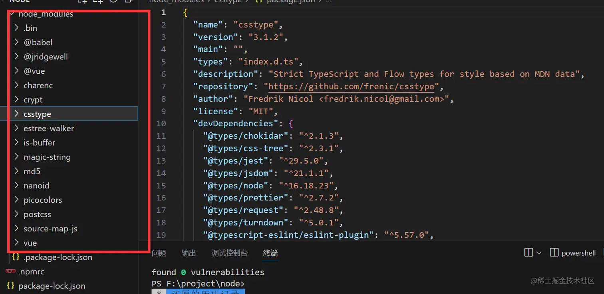
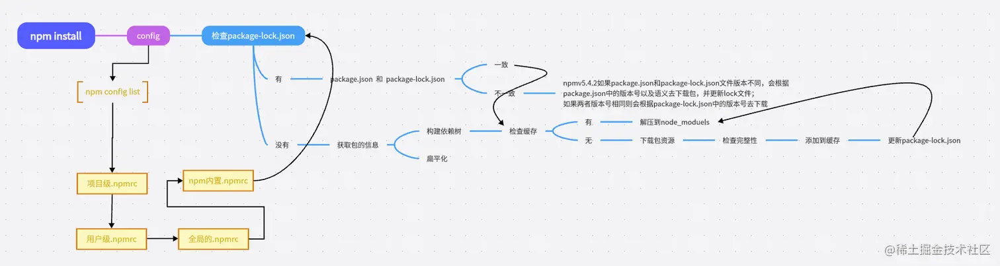

# 命令
- `npm init`：初始化一个新的 npm 项目，创建 package.json 文件。
- `npm install`：安装一个包或一组包，并且会在当前目录存放一个node_modules。
- `npm install <package-name>`：安装指定的包。
- `npm install <package-name> --save`：安装指定的包，并将其添加到 package.json 文件中的依赖列表中。
- `npm install <package-name> --save-dev`：安装指定的包，并将其添加到 package.json 文件中的开发依赖列表中。
- `npm install -g <package-name>`：全局安装指定的包。
- `npm update <package-name>`：更新指定的包。
- `npm uninstall <package-name>`：卸载指定的包。
- `npm run <script-name>`：执行 package.json 文件中定义的脚本命令。
- `npm search <keyword>`：搜索 npm 库中包含指定关键字的包。
- `npm info <package-name>`：查看指定包的详细信息。
- `npm list`：列出当前项目中安装的所有包。
- `npm outdated`：列出当前项目中需要更新的包。
- `npm audit`：检查当前项目中的依赖项是否存在安全漏洞。
- `npm publish`：发布自己开发的包到 npm 库中。
- `npm login`：登录到 npm 账户。
- `npm logout`：注销当前 npm 账户。
- `npm link`: 将本地模块链接到全局的 `node_modules` 目录下
- `npm config list` 用于列出所有的 npm 配置信息。执行该命令可以查看当前系统和用户级别的所有 npm 配置信息，以及当前项目的配置信息（如果在项目目录下执行该命令）
- `npm get registry` 用于获取当前 npm 配置中的 registry 配置项的值。registry 配置项用于指定 npm 包的下载地址，如果未指定，则默认使用 npm 官方的包注册表地址
- `npm set registry` `npm config set registry <registry-url>` 命令，将 registry 配置项的值修改为指定的 `<registry-url>` 地址
# package.json
执行npm init 便可以初始化一个package.json
1. `name`：项目名称，必须是唯一的字符串，通常采用小写字母和连字符的组合。
2. `version`：项目版本号，通常采用语义化版本号规范。
3. `description`：项目描述。
4. `main`：项目的主入口文件路径，通常是一个 JavaScript 文件。
5. `keywords`：项目的关键字列表，方便他人搜索和发现该项目。
6. `author`：项目作者的信息，包括姓名、邮箱、网址等。
7. `license`：项目的许可证类型，可以是自定义的许可证类型或者常见的开源许可证（如 MIT、Apache 等）。
8. `dependencies`：项目所依赖的包的列表，这些包会在项目运行时自动安装。
9. `devDependencies`：项目开发过程中所需要的包的列表，这些包不会随项目一起发布，而是只在开发时使用。
10. `peerDependencies`：项目的同级依赖，即项目所需要的模块被其他模块所依赖。
11. `scripts`：定义了一些脚本命令，比如启动项目、运行测试等。
12. `repository`：项目代码仓库的信息，包括类型、网址等。
13. `bugs`：项目的 bug 报告地址。
14. `homepage`：项目的官方网站地址或者文档地址。
# NPM install
> 首先安装的依赖都会存放在根目录的node_modules,默认采用扁平化的方式安装，并且排序规则.bin第一个然后@系列，再然后按照首字母排序abcd等，并且使用的算法是广度优先遍历，在遍历依赖树时，npm会首先处理项目根目录下的依赖，然后逐层处理每个依赖包的依赖，直到所有依赖都被处理完毕。在处理每个依赖时，npm会检查该依赖的版本号是否符合依赖树中其他依赖的版本要求，如果不符合，则会尝试安装适合的版本


**版本范围**：
- "x.x.x"，精确版本
- "~x.x.x"，允许到下一个次版本之前
- "^x.x.x"，允许到下一个大版本之前
## 扁平化
扁平化只是理想状态如下

**安装某个二级模块时，若发现第一层级有相同名称，相同版本的模块，便直接复用那个模块**
因为A模块下的C模块被安装到了第一级，这使得B模块能够复用处在同一级下；且名称，版本，均相同的C模块
非理想状态下


因为B和A所要求的依赖模块不同，（B下要求是v2.0的C，A下要求是v1.0的C ）所以B不能像2中那样复用A下的C v1.0模块 所以如果这种情况还是会出现模块冗余的情况，他就会给B继续搞一层node_modules，就是非扁平化了。
## 流程

```
执行 npm install
    │
    ├─ 1. 解析命令参数
    │      npm install
    │      npm install axios
    │      npm install --production
    │
    ├─ 2. 合并 npm 配置
    │      命令行参数
    │      环境变量
    │      项目级 .npmrc
    │      用户级 .npmrc
    │      全局级 .npmrc
    │      npm 内置默认值
    │
    ├─ 3. 读取项目状态
    │      package.json
    │      package-lock.json
    │      node_modules
    │      node_modules/.package-lock.json
    │
    ├─ 4. 计算理想依赖树
    │      解析语义化版本
    │      处理直接依赖
    │      处理传递依赖
    │      处理 peerDependencies
    │      处理 optionalDependencies
    │      去重、提升、嵌套
    │
    ├─ 5. 与实际依赖树比较
    │      哪些需要新增
    │      哪些需要升级
    │      哪些需要删除
    │      哪些可以保留
    │
    ├─ 6. 获取包内容
    │      优先检查本地缓存
    │      缓存不存在则访问 registry
    │      下载 tarball
    │
    ├─ 7. 完整性校验
    │      对比 integrity
    │
    ├─ 8. 修改 node_modules
    │      解压
    │      创建目录
    │      创建 .bin
    │      调整依赖层级
    │
    ├─ 9. 执行生命周期脚本
    │      preinstall
    │      install
    │      postinstall
    │      prepare 等
    │
    ├─ 10. 更新锁文件
    │       package-lock.json
    │       node_modules/.package-lock.json
    │
    └─ 11. 可选的安全审计和输出安装结果
```
## .npmrc
```
registry=http://registry.npmjs.org/
# 定义npm的registry，即npm的包下载源

proxy=http://proxy.example.com:8080/
# 定义npm的代理服务器，用于访问网络

https-proxy=http://proxy.example.com:8080/
# 定义npm的https代理服务器，用于访问网络

strict-ssl=true
# 是否在SSL证书验证错误时退出

cafile=/path/to/cafile.pem
# 定义自定义CA证书文件的路径

user-agent=npm/{npm-version} node/{node-version} {platform}
# 自定义请求头中的User-Agent

save=true
# 安装包时是否自动保存到package.json的dependencies中

save-dev=true
# 安装包时是否自动保存到package.json的devDependencies中

save-exact=true
# 安装包时是否精确保存版本号

engine-strict=true
# 是否在安装时检查依赖的node和npm版本是否符合要求

scripts-prepend-node-path=true
# 是否在运行脚本时自动将node的路径添加到PATH环境变量中

```
## package-lock.json
很多朋友只知道这个东西可以锁定版本记录依赖树详细信息
- version 该参数指定了当前包的版本号
- resolved 该参数指定了当前包的下载地址
- integrity 用于验证包的完整性
- dev 该参数指定了当前包是一个开发依赖包
- bin 该参数指定了当前包中可执行文件的路径和名称
- engines 该参数指定了当前包所依赖的Node.js版本范围
知识点来了，package-lock.json 帮我们做了缓存，他会通过 `name + version + integrity` 信息生成一个唯一的key，这个key能找到对应的index-v5 下的缓存记录 也就是npm cache 文件夹下的

如果发现有缓存记录，就会找到tar包的hash值，然后将对应的二进制文件解压到node_modeules

# Npm run
- 先从当前项目的node_modules/.bin去查找可执行命令vite
- 如果没找到就去全局的node_modules 去找可执行命令vite
- 如果还没找到就去环境变量查找
- 再找不到就进行报错
## 生命周期
```json
    "predev": "node prev.js",
    "dev": "node index.js",
    "postdev": "node post.js"
```
执行 npm run dev 命令的时候 predev 会自动执行 他的生命周期是在dev之前执行，然后执行dev命令，再然后执行postdev，也就是dev之后执行
运用场景例如npm run build 可以在打包之后删除dist目录等等
post例如你编写完一个工具发布npm，那就可以在之后写一个ci脚本顺便帮你推送到git等等
谁用到了例如vue-cli [github.com/vuejs/vue-c…](https://link.juejin.cn?target=https%3A%2F%2Fgithub.com%2Fvuejs%2Fvue-cli%2Fblob%2Fdev%2Fpackage.json "https://github.com/vuejs/vue-cli/blob/dev/package.json")

