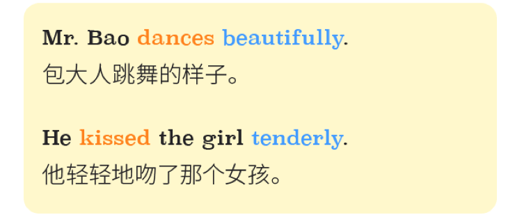
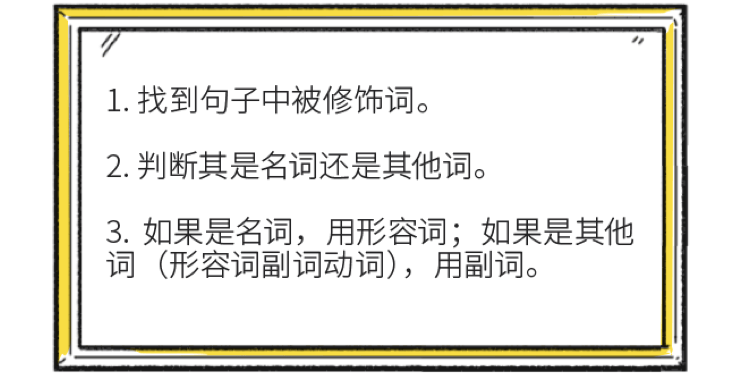

在英语中，这 副词 按 构词法大约分为两类：

「 一类是形容词+ly的派生词， 如，recently，politely，carefully等； 」，
「 另一类是不+ly的， （有些词跟它的形容词还长得一模一样 如，late，fast，hard） 」
# adv.+adj.

副词修饰形容词时， 形容词要让大胸弟在前。
# adv.+adv.

副词和副词在一起的时候， 修饰的那个在前。

注意：唯有enough这个副词，必须后置
# adv.+v.
## 放在前面
通常情况， 副词 放在 动词 后面当小跟班， 做他身后的男人

## 放在后面
1.一般情况放在 动词 后面， 但是如果放后面有歧义， 那 副词 就要放在 动词 前面。 我们把刚才的句子变了一下：

读这个句子时， 可能会懵逼， 因为这里到底 tenderly 是修饰 living 还是 kissed 呢？ 所以，这个时候副词要放在动词前面：

2. 如果修饰的副词表现语气很强烈，那就要放在动词前。

这样的副词还有 only/ merely/ also/ especially/ even/ particularly/ utterly/ almost/ surely 等等

我们总结出解决这类问题的三步骤

