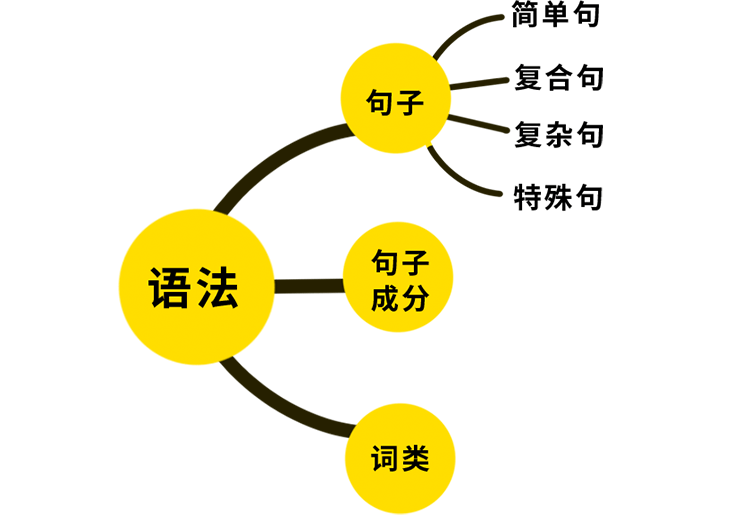
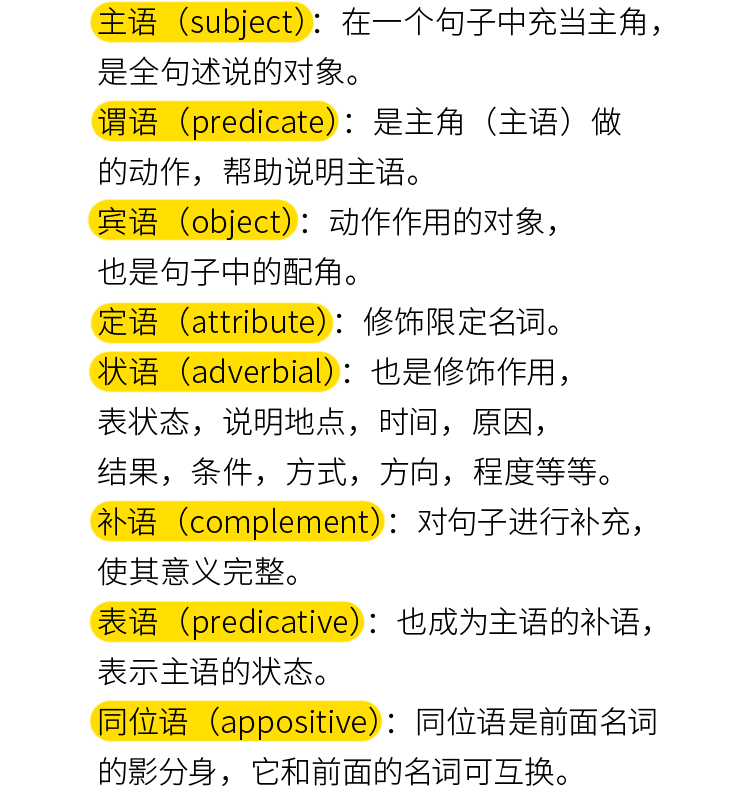
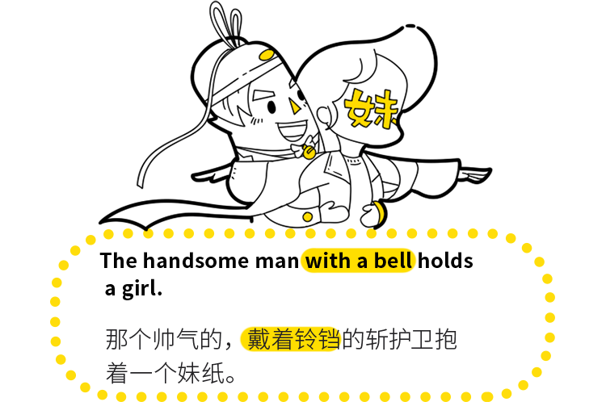
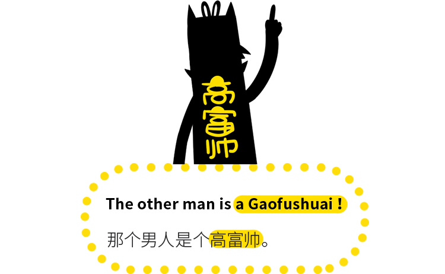
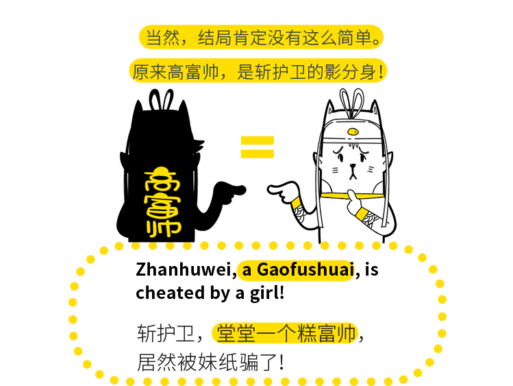

# 主语
句子中的 主语 就相当于是主角
# 谓语
谓语 就是主语发出的动作。
# 宾语
宾语 是主语发出动作的作用对象。
# 定语
在句子中修饰 主语 的，我们称之为 定语。

# 状语
状语是干啥的？作修饰，说明地点，时间，原因，结果，条件，方式，方向，程度等。
# 补语
补语 分为 主语补足语 和 宾语补足语 。主语 的 补语，就是放在 主语 后面的 补足语 ，像我们常说的 表语 ，也是 主语的补语 。

高富帅，是对 `the other man` 进行补充说明。主系表，也可以说成 主谓补 。
# 同位语

这就说到我们讲的 同位语 了，同位语 就是两个词语，都是在说同一个人。