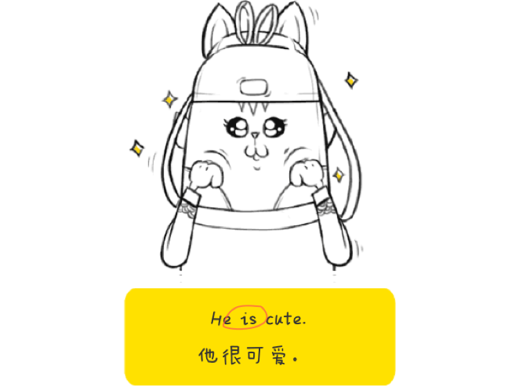
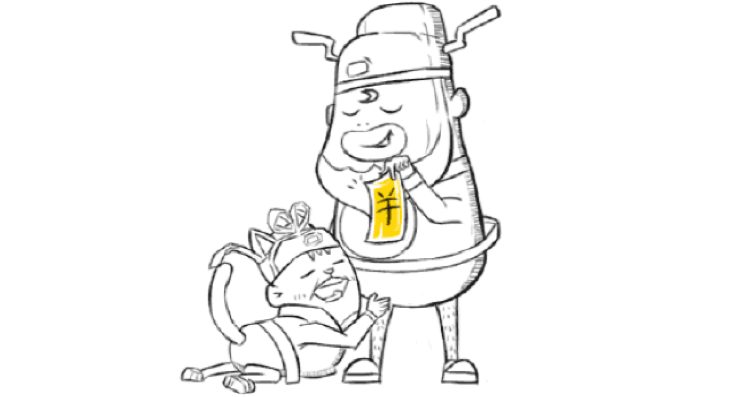
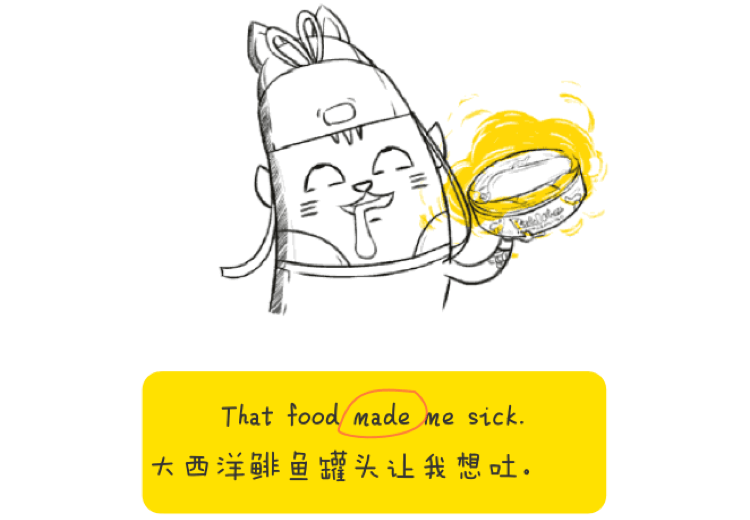
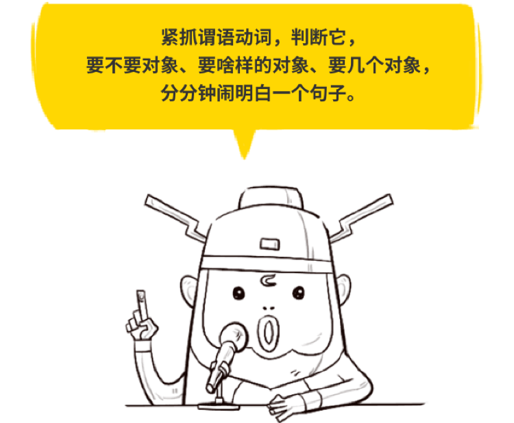

# 主谓

# 主谓宾

# 主谓补（主系表）

# 主谓宾宾、主谓宾补
这俩句型没啥本质区别，都属于，不满足于只演对手戏，还想来点道具呀、托儿呀什么的。就拿这场戏来说吧。

只说 lent me ，借我，是不完整的，还得有借我了什么东西，这个“东西”，就是第二个 宾语 。而到了这个句子里，

只说 made me，让我，也是不完整的，总得让我怎么着了吧，因此，我们就得带上个 补语 ，来说 宾语me 怎么着了。这5个句型，同学们不用死记。每个句型的拿手好戏不一样，构造自然也跟着不一样。

