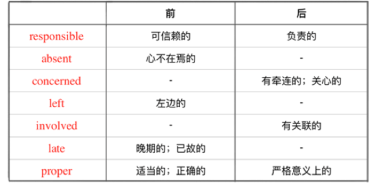

# 前置定语
名词短语 中，用形容词修饰一个 名词 ，通常结构为 「限定词+形容词+名词」
a stupid dog 一只蠢蠢的狗

the handsome man 那个帅气的男人

my cute girlFriend 我可爱的女朋友
多个形容词修饰一个名词时，按照下面的大原则：
「观点形容词 + 描绘形容词」
观点形容词：表示对事物的看法

描绘形容词：表示事物本身的特征、
描绘 形容词 那么多， 还是会争个先后， 越接近事物本质的 形容词 ，离 名词 越近， 这里有个小口诀：

再来理解下面的内容试试看呢

my old black Italian leather glove

a well-known German medical school

the beautiful big old red Chinese wooden table.
# 后置定语
1. some-，any-，no-，every-

somebody/anybody/nobody/everybody

something/anything/nothing/everything

someone/anyone/no one/everyone

在修饰「some，any，no，every」 和「one，thing，body」的 合成词 时， 形容词 要后置。

2. a- 开头的那些单词

如 「alone, afraid, aside, asleep, alike… 」

3. 修辞词太复杂了，后置！

当 修辞词 本身带有不定式， 介词 词组等补足成分时， 也要被后置。

带 介词 短语

The coat similar to yours is a birthday gift from my boyfriend. 那件跟你的（外套）相似的外套是我男票送我的生日礼物。

带不定式

Girls brave enough to pursue their dreams deserve to be loved. 敢于追求梦想的女孩值得被爱。
# 特殊
一般来说， 形容词 前置后置含义都不变， 不过凡事都有例外，看下面的例子。

这些词表示特定的词义必须前置或者后置

