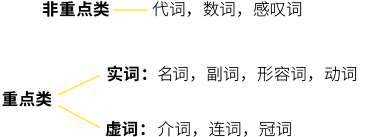
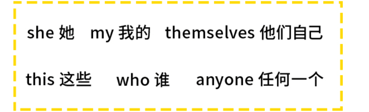
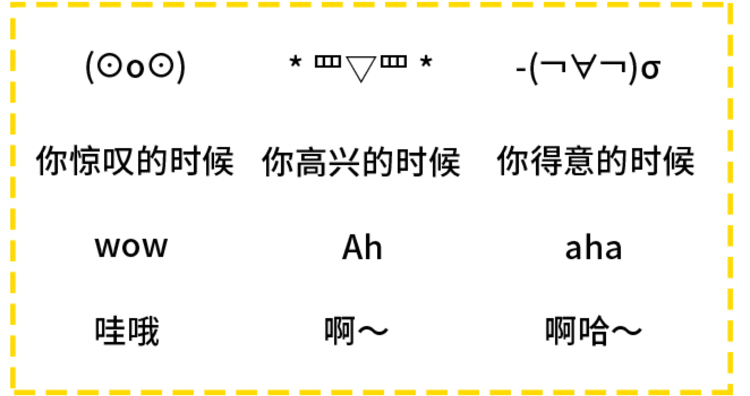
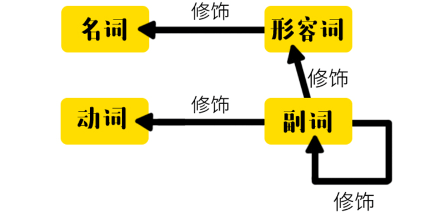
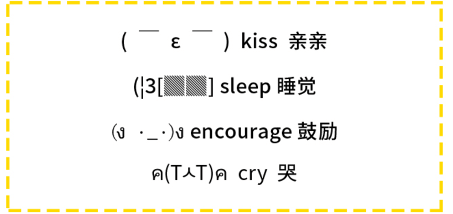
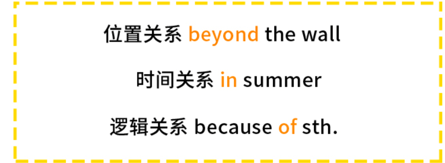

# 非重点类
## 代词
pron.
根据英文定义，
pronoun = pro（代替） + noun（名词）
代名词的词。

## 数词
num.
就是跟数字有关的单词。

## 感叹词
interj.`
 就是表示说话感情的词语。
 

# 实词

## 名词
n.
名词：名称的词性。
**是表示具体或者抽象事物/人物的词。**

## 动词
verb
**动词是表示动作或者状态的词。**

## 形容词
adjective
形容词：形容名词的词。

**对名词有修饰限定的作用**

## 副词
adverb
通常交代时间，地点，原因，程度等非核心信息。

他可以修饰形容词，动词，副词以及句子。

# 虚词
## 冠词
art.

它可以和世界上顶级的科技公司一起出现，起限定作用。

## 介词
prep.

他出现在 名词 的前面，表示名词于其他词之间的关系。
