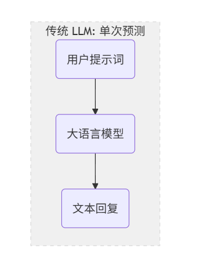
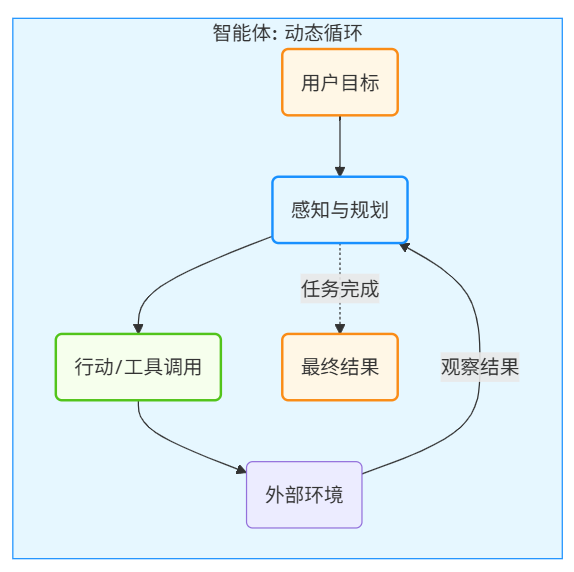
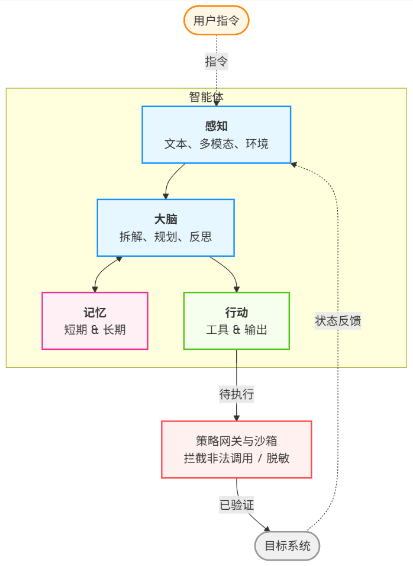
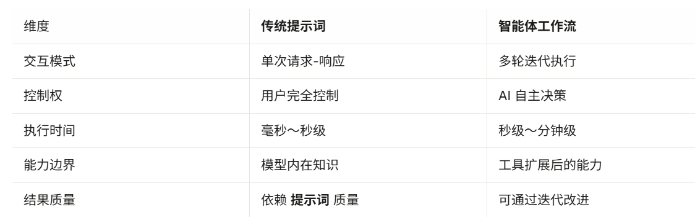
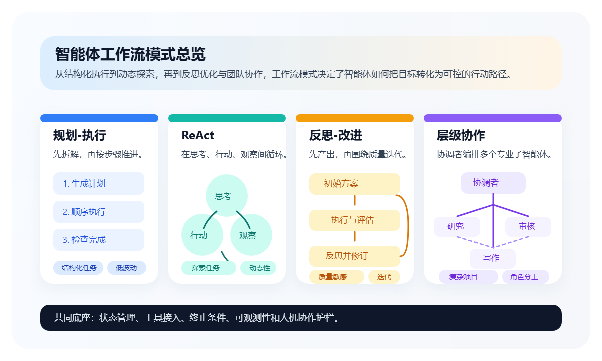

# 一、智能体范式革命
## 1.1 从大模型到智能体
### 1.1.1 Generative AI 到 Agentic AI

## 1.5智能体工作流
智能体工作流是一种让 AI 系统以 **迭代、自主、目标导向** 的方式完成复杂任务的工作模式。**核心特征**：
- **迭代式执行**：不是一次生成最终答案，而是多步骤逐渐逼近目标
- **自主决策**：AI 自主决定下一步行动，而非完全由用户控制
- **工具集成**：无缝调用外部工具和服务
- **状态管理**：维护执行过程中的中间状态
### 与传统提示词模式的区别

### 典型的智能体工作流模式
- 规划-执行模式
- ReAct模式
- 反思-改进模式
- 层级协作模式

# 二、推理
- CoT
- Tot/Got
- ReAct
- Reflexion
## 2.1 思维链与线性推理
