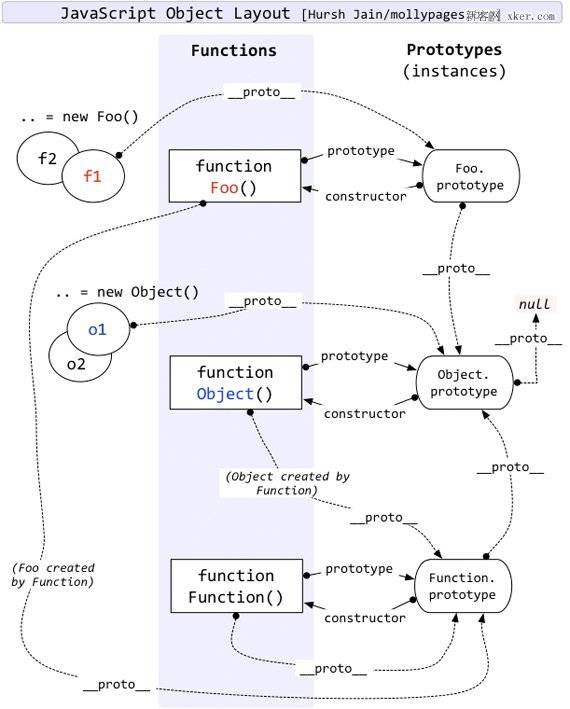
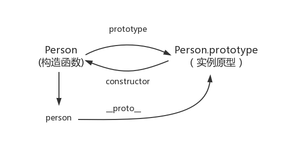
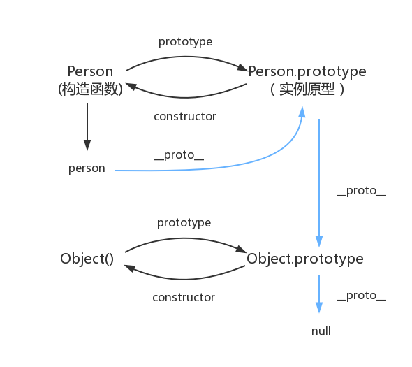

# 函数
列举几个重要函数
## 箭头函数
# 原型与原型链
记住这几点，忘记一切混乱：
不要关注prototype是怎么来的，关注prototype.proto
0. foo.proto=Foo.prototype
1. 所有属性都是从proto上找，当前对象没有就去当前对象的proto对应Foo.prototype，Foo.prototype也是个对象，同理它找不到这个属性就要去它的proto找。
2. 区别Foo.proto和Foo.prototype，前者从函数本身是对象的角度看，值是Function.prototype，后者是一个Magic 对象，不由我们创造，追其溯源，是Object对象，所以Foo.prototype.proto=Object.prototype
3. Function.proto=Function.prototype
4. Object.proto=Function.prototype
5. Object.prototype.proto=null

## prototype,proto,constructor
prototype是函数才有的一个属性，这个属性指向一个对象，用这个函数创建的对象其原型（proto）就是这个对象，默认是Object空对象。
在js中函数也是一个对象，所以他也有proto：Function.prototype
- 那么对于Function这个特殊的函数，同时也是一个对象，它的proto是谁，是它自己，这不是鸡生蛋问题，它们俩都是只是一个地址的引用。
- 再继续追溯Function.prototype.proto，我们会得到Object函数，它的proto是null，没有人创造它。
- 实例对象和构造函数都有属性指向原型(proto和prototype)，那么原型能不能反过来指向实例对象或者构造函数呢，原型中有一个属性constructor可以指向构造函数，constructor属性其实就是一个拿来保持自己构造函数的引用的对象，没有什么特别的地方。

```js
Person <===> Person.prototype.constructor
person.__proto__ <===> Person.prototype <===> new Person() 
Object.getPrototypeOf(person) <===> Person.prototype
```
## 原型链
虽然JS的原型系统感觉有点混乱，但是我们只要记住一条原则：
属性永远从proto上找，自己的proto找不到，就从自己proto的proto找，这就是原型链。
一个复杂的点就是prototype，prototype的复杂性在于，按照惯性思维实例对象的proto应该是它的模板，一般会直观的想到对应的构造函数，这和静态面向对象的Class一样，符合直觉。
js的原型反直觉的是实例对象的proto是其构造函数的prototype，而不是构造函数本身。

```js
/**
 * person 上没有 constructor 属性，所以就通过 person.__proto__ 去原型对象中找，
 * 刚好 Person.prototype 这个原型对象中有 constructor
*/
person.constructor <===> Person.prototype.constructor <===> Persion 
```


# 面向对象编程
## 原型
```js
const user = {
    name: "Tom",
    sayHello() {
        console.log("Hello");
    }
}
```
## Class
```js
class User {
	static count = 0;

    constructor(name){
        this.name=name;
    }


    sayHello(){
        console.log(
            "Hello "+this.name
        );
    }

}


const user=new User("Tom");

user.sayHello();
```
## 继承与Mixin
JS只支持单继承，查找属性/方法，走的是原型链。
# 模块化
## 游览器中的JS
### HTML中直接写JS
```html
<!DOCTYPE html>
<html>
<head>
    <title>Demo</title>
</head>
<body>

    <button onclick="alert('hello')">点击</button>

    <script>
        console.log("hello JavaScript");
    </script>
</body>
</html>
```
**内联脚本**，游览器从上往下解析html，遇到js就直接执行
### 外部引入JS
```html
<html>
<head>
    <script src="./main.js"></script>
</head>

<body>
    <h1>Hello</h1>
</body>
</html>
```
顺序执行，遇到js脚本就等待下载，下载完就执行，执行完在继续解析dom，阻塞dom解析。
多个引入的js按照上面提到的步骤顺序阻塞。
由于阻塞的特性，一般把引入的js放在
### defer、async
defer的逻辑：
```
HTML解析 ──────────────────────────
     │
     ├── 同时下载 JS ─────────
     │
HTML解析完成
     ↓
执行 defer JS
     ↓
DOMContentLoaded
```
多个defer不保证下载完成的顺序，但是保证执行顺序：
```
并行下载
+
按 HTML 中出现顺序执行
```
async的逻辑：
```
HTML解析 ─────────────┐
                     │
下载 JS ────────完成   │
              ↓       │
          暂停HTML解析
              ↓
           执行JS
              ↓
HTML解析 ──────────────
```
async不能保证下载顺序，同时也不能保证执行顺序。
### 全局污染
- 早期多个js共享一个全局作用域：
```
window 全局作用域
```
- 命名空间：
```js
var MyApp = {};
MyApp.user = {
    name: "Alice",

    login() {
        console.log("login");
    }
};
```
这种写法虽然手动隔离了变量作用域，但是防君子不防小人，对象内部的变量可以被任意访问。
- IIFE：立即执行函数:
```js
(function () {})()
```
IIFE是一个解决方案，能创建私有作用域。
```
全局作用域 │ 
	└── IIFE作用域 
		├── name
		├── login 
		└── 其他变量
```
由于这个函数没有名字，所以内部的变量也不能被访问。
### cjs、amd、broswerfiy
### ESM
## CommonJs
CJS 是 Node.js 的默认模块化方案，核心是 `module.exports` 和 `require`，**所有导出都是 “值的引用”，且导出的是一个对象（或原始值）**。
##### （1）核心语法

| 操作     | 语法示例                                  | 说明                               |
| ------ | ------------------------------------- | -------------------------------- |
| 导出单个值  | `module.exports = 123;`               | 直接导出原始值（覆盖默认导出对象）                |
| 导出多个值  | `module.exports = { add, User };`     | 导出一个对象，包含多个成员                    |
| 便捷导出   | `exports.add = (a,b) => a+b;`         | `exports` 是 `module.exports` 的引用 |
| 导入     | `const { add } = require('./utils');` | 同步导入，解构导出对象的成员                   |
| 导入整个模块 | `const utils = require('./utils');`   | 导入导出的完整对象                        |

##### （2）导出 / 导入的本质（关键）
- **导出的是什么**：
    - `module.exports` 是一个**普通 JS 对象**（默认是空对象 `{}`），你可以给它赋值任意类型（原始值、函数、对象等）；
    - `exports` 只是 `module.exports` 的引用，**不能直接给 `exports` 赋值**（比如 `exports = 123` 无效，因为会断开引用）。
   
- **导入的是什么**：
    - `require()` 函数执行时，会读取目标文件的代码，**执行**后返回 `module.exports` 的值；
    - 导入的是**值的引用**（运行时确定），如果导出的值后续被修改，导入方也会看到变化。    
##### （3）完整示例
```js
// utils.js (CJS 模块)
// 定义内部变量
const version = '1.0';

// 导出函数（便捷方式）
exports.add = function(a, b) {
  return a + b;
};

// 导出对象（覆盖 exports 引用，不推荐混合使用）
module.exports = {
  version,
  multiply: (a, b) => a * b
};

// index.js (导入)
// 导入整个导出对象
const utils = require('./utils');
console.log(utils.version); // '1.0'
console.log(utils.multiply(2, 3)); // 6

// 解构导入
const { multiply } = require('./utils');
console.log(multiply(3, 4)); // 12
```
## ESM
ESM 是 ES6 推出的官方标准，核心是 `export` 和 `import`，**导出的是 “绑定关系”（而非值），支持多种导出形式**。
##### （1）核心语法

| 操作       | 语法示例                                     | 说明                  |
| -------- | ---------------------------------------- | ------------------- |
| 命名导出（多个） | `export const add = (a,b) => a+b;`       | 导出单个成员（可多个）         |
| 命名导出（批量） | `export { add, User };`                  | 批量导出已定义的成员          |
| 默认导出（单个） | `export default function() {};`          | 每个模块只能有一个默认导出       |
| 导入命名成员   | `import { add } from './utils.js';`      | 解构导入命名导出的成员         |
| 导入默认成员   | `import add from './utils.js';`          | 导入默认导出的成员           |
| 导入整个模块   | `import * as utils from './utils.js';`   | 导入为一个模块对象（所有成员挂在上面） |
| 动态导入     | `import('./utils.js').then(utils => {})` | 异步导入（运行时执行）         |
|          |                                          |                     |

##### （2）导出 / 导入的本质（关键）
- **导出的是什么**：
    - 命名导出：导出的是**变量 / 函数的绑定关系**（不是值的拷贝），如果导出方修改了变量值，导入方会同步更新；
    - 默认导出：本质是命名为 `default` 的特殊命名导出，`export default xxx` 等价于 `export { xxx as default }`；
    - ESM 是**静态的**（编译期分析），`export/import` 必须放在顶层（不能在 if 里），这也是它能支持树摇的原因。
- **导入的是什么**：
    - 导入的是**绑定关系**（而非值的拷贝），且导入的成员是只读的（不能修改导入的变量）；
    - 模块对象（`import * as utils`）是只读的，不能修改其属性。    
##### （3）完整示例
```js
// utils.js (ESM 模块)
// 命名导出
export const version = '1.0';
export function add(a, b) {
  return a + b;
}

// 默认导出
export default function multiply(a, b) {
  return a * b;
}

// index.js (导入)
// 导入命名成员 + 默认成员
import multiply, { version, add } from './utils.js';
console.log(version); // '1.0'
console.log(add(1, 2)); // 3
console.log(multiply(2, 3)); // 6

// 导入整个模块为对象
import * as utils from './utils.js';
console.log(utils.version); // '1.0'
console.log(utils.default(3, 4)); // 12（默认导出在 default 属性里）
```

# 原型链
# 闭包
# EventLoop
# Promise
# WebComponent
# WASM
